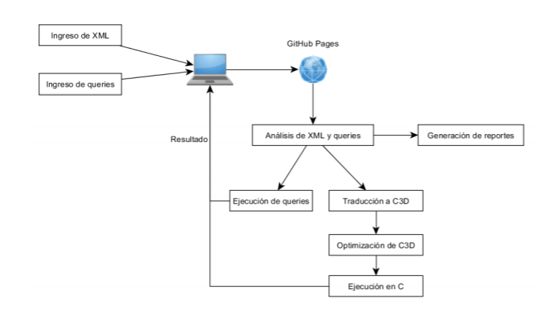

#### Universidad de San Carlos de Guatemala
#### Facultad de Ingeniería
#### Escuela de Ciencias y Sistemas
#### Área de Ciencias de la Computación
#### Organización de Lenguajes y Compiladores 2 - Sección A
#### Ing. Luis Fernando Espino Barrios
#### Aux. Haroldo Arias   
 

<table class="default">
  <tr>
    <th>Nombre</th>
    <th>Carnet</th>
  </tr>
  <tr>
    <td>Oscar Roberto Velasquez de Leon</td>
    <td>201709144</td>
  </tr>
  <tr>
    <td>Aybson Diddiere Mercado Grijalva</td>
    <td>201700312</td>
  </tr>
  <tr>
    <td>Adrian Byron Ernesto Alvarado Alfaro</td>
    <td>201700308</td>
  </tr>
</table>

 

## Índice
- [TytusX Grupo 7 - TytusDB](#TytusX_Grupo_7_-_TytusDB) 
- [Objetivos](#Objetivos)
- [Requisitos_del_Sistema](#Requisitos_del_Sistema)
- [Componentes](#Componentes)
- [Análisis_Léxico_XML](#Análisis_Léxico_XML)
- [Análisis_Sintáctico_XML_ASC](#Análisis_Sintáctico_XML_ASC)
- [Análisis_Sintáctico_XML_DESC](#Análisis_Sintáctico_XML_DESC)
- [Análisis_Léxico_XPATH](#Análisis_Léxico_XPATH)
- [Análisis_Sintáctico_XPATH_DESC](#Análisis_Sintáctico_XPATH_DESC)
- [Análisis_Sintáctico_XPATH_ASC](#Análisis_Sintáctico_XPATH_ASC)
- [Archivo_Entrada_XML](#Archivo_Entrada_XML)
- [Archivo_Entrada_XPATH](#Archivo_Entrada_XPATH)
- [Salida](#Salida)

 

# TytusX_Grupo_7_-_TytusDB

TytusX es un proyecto Open Source Native XML Database with Query Languages XPath and XQuery in JavaScript. Este proyecto es desarrollado por estudiantes de la Universidad de San Carlos de Guatemala con el fin de cumplir con un compilador capaz de interpretar lenguaje XML y traducir mediante consultas en XPATH A xml para poder obtener el resultado.TytusX es un administrador de bases de datos  documental de código abierto desarrollado bajo licencia MIT que utilizará lenguaje JavaScript para su construcción. Soportará archivos XML y manejará los lenguajes de consultas XPath y XQuery.

 

## Objetivos  
### General  
* 
Objetivo general

* 
Que el estudiante aplique la fase de analisis y sintesis de la construccion de un compilador para realizar por un lado un interprete y por otro lado un traductor a un codigo ejecutable utilizando herramientas de analisis ascendente.

### Específicos  
* 
Objetivos específicos

* 
Que el estudiante genere un analizador lexico y sintactico para construir un interprete haciendo uso de atributos heredados y sintetizados.

* 
Que el estudiante utilice tanto una gramática adecuada para el analizador ascendente y otra gramática adecuada para el analizador descendente.

* 
Que el estudiante maneje la pila o el árbol que proporciona el analizador sintáctico para simular el paso de atributos heredados.

* 
Que el estudiante implemente la ejecución de la traducción utilizando traducción dirigida por la sintaxis.

* 
Que el estudiante comprenda los conceptos acerca de traducciones.

* 
Que el estudiante traduzca el código fuente a un código de tres direcciones.

* 
Que el estudiante aplique las reglas de optimización en el código de tres direcciones previo a su ejecución.

 

## Requisitos_del_Sistema

El programa se podrá ejecutarse media vez se cumplan con las siguientes
características mínimas:  

* Procesador Intel(R) Core(TM) i5-7200U CPU @ 2.50GHz, 2712 Mhz, 2 procesadores principales, 4 procesadores lógicos
* Javascript  
* Sistema Operativo: Windows 7 o superior.

 

## Componentes

<h3>XML - XPATH Compilador G7</h3>

La página debe mostrar 3 segmentos: el primero, en la parte superior a la izquierda con el XML por utilizar; el segundo, el segmento superior a la derecha con el query o los queries; y el tercero, el segmento inferior que mostrará el resultado del query o de los queries. Cada segmento solamente contendrá una pestaña, es decir, no se puede abrir más de un XML ni más de un archivo de queries.

  

## Análisis_Léxico_XML

### Palabras reservadas
~~~
<reservadas> ::= <?xml version | ?> | encoding | standalone

~~~

### Caracteres especiales

~~~
<caracter_especial> ::= <IGUAL> | <BLANCO> |
    <MAYORAB> |
    <MENORAB> |
    <MAYORABD> |
    <MENORABD> |
    <ID> |
    <CADENA> |
    <CARACTER> |
    <COMENTARIO_MULTILINEA> |
    <COMENTARIO_SIMPLE> 

<IGUAL> = =
<MAYORAB> = >
<MENORAB> = <
<MAYORABD> = />
<MENORABD> = </

~~~

## Análisis_Sintáctico_XML_ASC

### Gramatica Ascendente

~~~

<<INICIO>> ::= <PROLOGO> <EOF> 
			
<PROLOGO> ::= <?xml version <VERSION> <CODIFICACION> <DEPENDENCIA> ?> <RAIZ>
            | <RAIZ>

<VERSION> ::= = <cadena>

<CODIFICACION> ::= encoding = <cadena>
                |

<DEPENDENCIA> ::= standalone = <cadena>
                |

<RAIZ> ::= = <ETIQUETA>

<ETIQUETA> ::=  <ETIQUETA_UNICA>
                | <APERTURA> <CONTENIDO> <CIERRE>
                | <APERTURA> <CIERRE>                

<ETIQUETA_UNICA> ::= < <etiqueta> <ATRIBUTOS> />

<APERTURA> ::= < <etiqueta> <ATRIBUTOS> >
                |< <etiqueta> >

<ATRIBUTOS> ::= <ATRIBUTOS> <ATRIBUTO>
                | <ATRIBUTO>

<ATRIBUTO> ::= <etiqueta> = <cadena>

<CONTENIDO> ::= <CONTENIDO> <LISTACONT>
                | <LISTACONT>

<LISTACONT> ::= <cadena> 
                | <numero> 
                | <ETIQUETA>                 
                | <CARACESPECIAL> 

<CARACESPECIAL> ::= &lt;
                | &gt;
                | &amp;
                | &apos;
                | &quot;

<CIERRE> ::= </ <etiqueta> >

~~~

## Análisis_Sintáctico_XML_DESC

### Gramatica Descendente 
    
~~~
<<INICIO>> ::= <PROLOGO> <EOF> 
			
<PROLOGO> ::= <?xml version <VERSION> <CODIFICACION> <DEPENDENCIA> ?> <RAIZ>
            | <RAIZ>

<VERSION> ::= = <cadena>

<CODIFICACION> ::= encoding = <cadena>
                |

<DEPENDENCIA> ::= standalone = <cadena>
                |

<RAIZ> ::= = <ETIQUETA>

<ETIQUETA> ::=  <ETIQUETA_UNICA>
                | <APERTURA> <CONTENIDO> <CIERRE>

<ETIQUETA_UNICA> ::= < <etiqueta> <ATRIBUTOS> />

<APERTURA> ::= < <etiqueta> <ATRIBUTOS> >

<ATRIBUTOS> ::= <ATRIBUTO> <ATRIBUTOS>
                |

<ATRIBUTO> ::= <etiqueta> = <cadena>

<CONTENIDO> ::= <cadena> <CONTENIDO>
                | <numero> <CONTENIDO>
                | <ETIQUETA> <CONTENIDO>                
                | <CARACESPECIAL> <CONTENIDO>
                |

<CARACESPECIAL> ::= &lt;
                | &gt;
                | &amp;
                | &apos;
                | &quot;

<CIERRE> ::= </ <etiqueta> >

~~~

## Análisis_Léxico_XPATH

### Palabras reservadas
~~~
<reservadas> ::= or | and | mod | div
            node | text | namespace-node |
            ancestor-or-self | ancestor |
            attribute | child | descendant-or-self |
            descendant | following-sibling | following |
            namespace | parent | preceding-sibling |
            preceding | self | node | last | 
            position 
~~~

### Caracteres especiales

~~~
<caracter_especial> ::= <BARRAOR> | <BLANCO> | <CADENA> | <CARACTER> |
    <IDENTIFICADOR> |
    <MAS> |
    <MENOS> |
    <POR> |
    <INDIFERENTE> |
    <IGUAL> |
    <MENORIGUAL> |
    <MENOR> |
    <MAYORIGUAL> |
    <MAYOR> |
    <CUATROPUNTOS> |
    <DOBLEDIAGONAL> |
    <DIAGONAL> |
    <ARROBA> |
    <DOSPUNTOS> |
    <PARENTIZQ> |
    <PARENTDER> |
    <CORCHEIZQ> |
    <CORCHEDER> |
    <PUNTO>

    <BARRAOR> = |
    <MAS> = +
    <MENOS> = -
    <POR> = * 
    <INDIFERENTE> = !=
    <IGUAL> = =
    <MENORIGUAL> = <=
    <MENOR> = <
    <MAYORIGUAL> = >=
    <MAYOR> = >
    <CUATROPUNTOS> = ::
    <DOBLEDIAGONAL> = //
    <DIAGONAL> = /
    <ARROBA> = @
    <DOSPUNTOS> = ..
    <PARENTIZQ> = (
    <PARENTDER> = )
    <CORCHEIZQ> = [
    <CORCHEDER> = ]
    <PUNTO> = . 

~~~

## Análisis_Sintáctico_XPATH_DESC

### Gramatica Descendente 
    
~~~
<<INICIO>> ::= <ELEMENTO> <EOF> 
			
<ELEMENTO> ::= <EXPRESION> <ELEMENTO_P>

<ELEMENTO_P> ::= | <EXPRESION> <ELEMENTO_P>

<EXPRESION> ::= <RESERVA> <RESERVA_P>
                | <SIMBOLOS> <CAJETIN> <SIMBOLOS_P>
                | <identificador> <CAJETIN> <SIMBOLOSSECU> <SIMBOLOSSECU_P>
                | <identificador>
                | * <CAJETIN>

<SIMBOLOS> ::=    / <CONTENIDODOS>
                | // <CONTENIDODOS>
                | @ <ARROPROD>
                | .. <PRODUCT> <CONTENIDODOS>
                | . <PRODUCT> <CONTENIDODOS>
                | * <CONTENIDO>

<SIMBOLOS_P> ::=  <EXPRESION>
                |

<SIMBOLOSSECU> ::= / <CONTENIDODOS>
                | // <CONTENIDODOS>
                | @ <ARROPROD>
                | .. <PRODUCT> <CONTENIDODOS>
                | * <CONTENIDO>

<SIMBOLOSSECU_P> ::=  <EXPRESION>
                |

<RESERVA> ::= ancestor <ITEMRESERVA>
            | ancestor-or-self <ITEMRESERVA>
            | attribute <ITEMRESERVA>
            | child  <ITEMRESERVA>
            | descendant-or-self  <ITEMRESERVA>
            | descendant <ITEMRESERVA>
            | following-sibling <ITEMRESERVA>
            | following <ITEMRESERVA>
            | namespace <ITEMRESERVA>
            | parent <ITEMRESERVA>
            | preceding-sibling <ITEMRESERVA>
            | preceding <ITEMRESERVA>
            | self <ITEMRESERVA>
            | last  ( )
            | position ( ) 
            | text ( )

<RESERVA_P> ::=  <EXPRESION>
                |

<PRODUCT> ::=  /
                | //

<ARROPROD> ::=  *
                | <identificador>

<CONTENIDO> ::= <identificador>

<CONTENIDODOS> ::= @ <ARROPROD>
                    | <identificador>
                    | *
                    | ..
                    | <RESERVA>

<CONTENIDO_P> ::=  <EXPRESION>
                |

<CAJETIN> ::=  [ <PREDICADO> ]
                |

<PREDICADO> ::= <OPERACIONES>

<OPERACIONES> ::= <ITEMINICIO> <OPERADOR> <ITEMFINAL> <OPERACIONES_L>
                    | <ITEMINICIO>

<ITEMINICIO> ::=  <RESERVA>
                | <identificador>
                | @ <ARROPROD>
                | <numero>
                | .

<OPERADOR> ::=  +
                | -
                | *
                | div
                | =
                | !=
                | <=
                | <
                | >=
                | >
                | mod

<ITEMFINAL> ::=  <RESERVA>
                | <caracter>
                | <cadena>
                | <identificador>                
                | @ <ARROPROD>
                | <numero>

<OPERACIONES_L> ::= or <OPERACIONES>
                | and <OPERACIONES>
                |

<ITEMRESERVA> ::= :: <SIMBOLOSTERC>
                |

<SIMBOLOSTERC> ::= <identificador>
                | *
                | <RESERVA>
                | / <CONTENIDODOS>
                | // <CONTENIDODOS>
                | @ <ARROPROD>
                | .. 

~~~

## Análisis_Sintáctico_XPATH_ASC

### Gramatica Ascendente

~~~
<<INICIO>> ::= <ELEMENTO> <EOF> 
			
<ELEMENTO> ::= <ELEMENTO> <ELEMENTO_P>
               | <ELEMENTO_P> 

<ELEMENTO_P> ::= | <EXPRESION> 
                | <ELEMENTO_P>

<EXPRESION> ::= <EXPRESION> <CONTENIDO>
                | <SIMBOLOS>

<SIMBOLOS> ::=    / 
                | //
                | @ <ARROPROD>
                | .. 
                | . 
                | *
                | <identificador>
                | <numero>
                | <RESERVA>

<ARROPROD> ::=  *
                | <identificador>

<CONTENIDO> ::= [ <COMPLEMENTO> ]
                | [ <EXPRESION> ]
                | [  ]

<COMPLEMENTO> ::=  <EXPRESION> <PREDICADO>

<PREDICADO> ::=  <OPERACIONES>

<OPERACIONES> ::=  <OPERADOR> <MASSENTENCIA>
                    | <OPERADOR>

<OPERADOR> ::=  +
                | -
                | *
                | div
                | =
                | !=
                | <=
                | <
                | >=
                | >
                | mod

<MASSENTENCIA> ::=  <ITEMFINAL> or <COMPLEMENTO>
                | <ITEMFINAL> and <COMPLEMENTO>
                | <ITEMFINAL>

<ITEMFINAL> ::= <RESERVA>
                    | <caracter>
                    | <cadena>
                    | <identificador>
                    | @ <ARROPROD>
                    | <numero>
                    | /
                    | //
                    | ..
                    | .
                    | *

<RESERVA> ::= ancestor <ITEMRESERVA>
            | ancestor-or-self <ITEMRESERVA>
            | attribute <ITEMRESERVA>
            | child  <ITEMRESERVA>
            | descendant-or-self  <ITEMRESERVA>
            | descendant <ITEMRESERVA>
            | following-sibling <ITEMRESERVA>
            | following <ITEMRESERVA>
            | namespace <ITEMRESERVA>
            | parent <ITEMRESERVA>
            | preceding-sibling <ITEMRESERVA>
            | preceding <ITEMRESERVA>
            | self <ITEMRESERVA>
            | last  ( )
            | position ( ) 
            | text ( )

<ITEMRESERVA> ::= :: <SIMBOLOS>
                |

~~~

## Archivo_Entrada_XML

<h3>Ejemplo de Archivo Entrada:</h3>

~~~
<?xml version="1.0" encoding="UTF-8"?>
<biblioteca>
    <libro>
        <titulo>La vida está en otra parte</titulo>
        <autor>Milan Kundera</autor>
        <fechaPublicacion año="1973"/>
    </libro>
    <libro>
        <titulo>Pantaleón y las visitadoras</titulo>
        <autor fechaNacimiento="28/03/1936">Mario Vargas Llosa</autor>
        <fechaPublicacion año="1973"/>
    </libro>
    <libro>
        <titulo>Conversación en la catedral</titulo>
        <autor fechaNacimiento="28/03/1936">Mario Vargas Llosa</autor>
        <fechaPublicacion año="1969"/>
    </libro>
</biblioteca>
~~~

## Archivo_Entrada_XPATH

~~~

/biblioteca/libro

~~~

## Salida

~~~

<libro >
  <titulo >
    La vida está en otra parte
  </titulo>
  <autor >
    Milan Kundera
  </autor>
  <fechaPublicacion año="1973"/>
</libro>
<libro >
  <titulo >
    Pantaleón y las visitadoras
  </titulo>
  <autor fechaNacimiento="28/03/1936">
    Mario Vargas Llosa
  </autor>
  <fechaPublicacion año="1973"/>
</libro>
<libro >
  <titulo >
    Conversación en la catedral
  </titulo>
  <autor fechaNacimiento="28/03/1936">
    Mario Vargas Llosa
  </autor>
  <fechaPublicacion año="1969"/>
</libro>

~~~