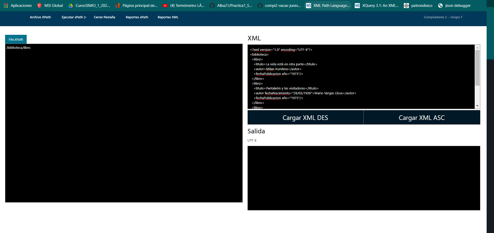
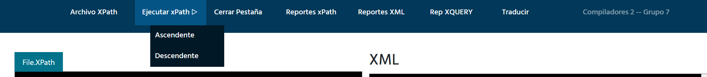
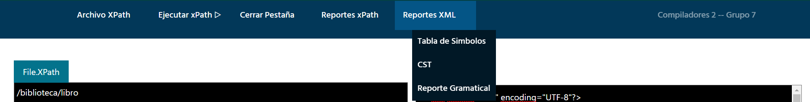
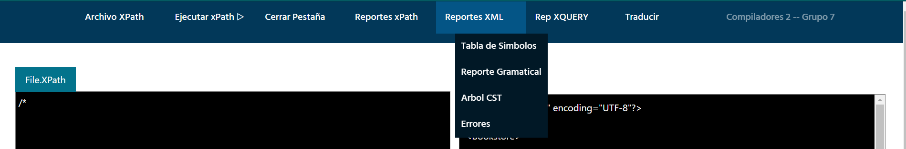
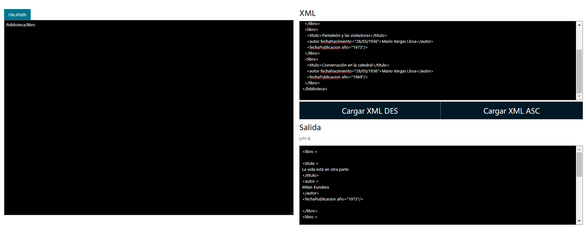
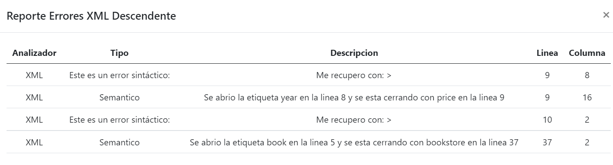
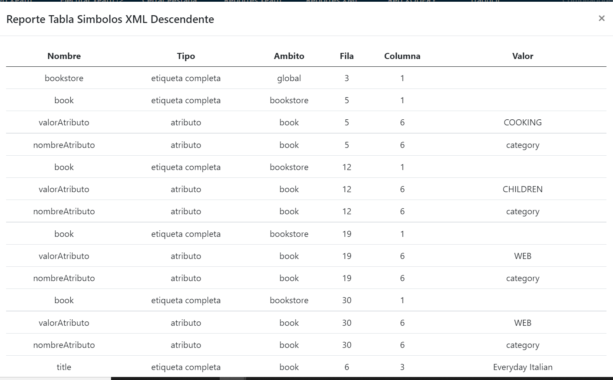
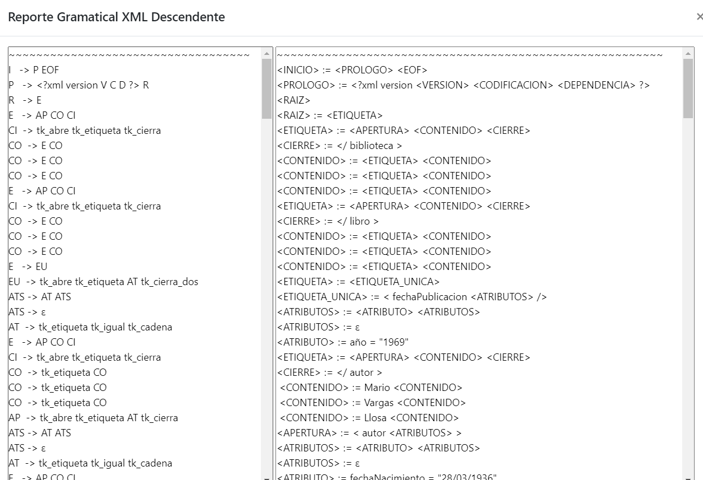
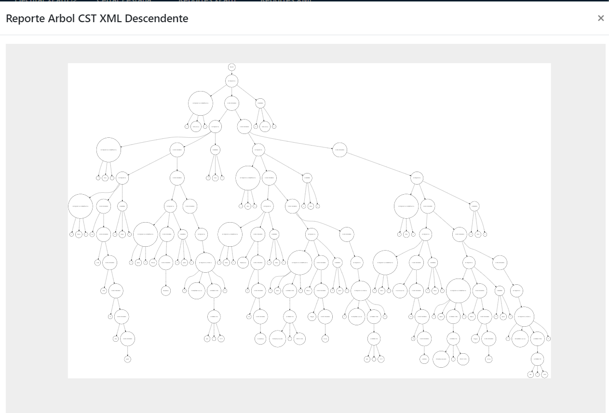

#### Universidad de San Carlos de Guatemala
#### Facultad de Ingeniería
#### Escuela de Ciencias y Sistemas
#### Área de Ciencias de la Computación
#### Organización de Lenguajes y Compiladores 2 - Sección A
#### Ing. Luis Fernando Espino Barrios
#### Aux. Haroldo Arias   
 

<table class="default">
  <tr>
    <th>Nombre</th>
    <th>Carnet</th>
  </tr>
  <tr>
    <td>Oscar Roberto Velasquez de Leon</td>
    <td>201709144</td>
  </tr>
  <tr>
    <td>Aybson Diddiere Mercado Grijalva</td>
    <td>201700312</td>
  </tr>
  <tr>
    <td>Adrian Byron Ernesto Alvarado Alfaro</td>
    <td>201700308</td>
  </tr>
</table>

 

## Índice
- [TytusX Grupo 7 - TytusDB](#TytusX_Grupo_7_-_TytusDB) 
- [Barra de Menú](#Barra_de_Menú)
- [Consola de Salida](#Consola_Salida)
- [Tabla de Errores](#Tabla_Errores)
- [Tabla de Simbolos](#Tabla_Simbolos)
- [Reporte_Gramatical](#Reporte_Gramatical)
- [Arbol_CST_XML_desc](#Arbol_CST_XML_desc)

 

# TytusX_Grupo_7_-_TytusDB

Cuando se inicia la aplicacion, se podrá ver toda la interfaz QueryTool con todos sus módulos que la componen e igualmente las operaciones encargadas del funcionamiento del proyecto, tales como las opciones siguientes: guardar, guardar como, ver árbol, Analizar, entre otros que se detallaran mas adelante.  
 
 

  

 

## Barra_de_Menú 

  
  
    

* ### Abrir: 
Esta opción permite abrir cualquier archivo que contenga texto plano, y crea una nueva pestaña con el contenido del archivo.
* ### Guardar
Esta opción es para que guarde un archivo donde el contenido de la misma es lo que está en la pestaña seleccionada actualmente.
* ### Tabla de Errores
En Esta tabla se puede abrir el Reporte de Errores Léxicos, Sintácticos y Semanticos que contenga el Archivo de Entrada.
* ### Tabla de Simbolos
Esta opción muestra las etiquetas y sus respectivos entornos en donde se encuentra cada una de las mismas, especificando su ambito y posicion dentro del archivo de entrada XML.
* ### AST
Esta opción muestra el árbol de sintaxis abstracta utilizando unicamente las producciones requeridas para el analisis del XPATH.
* ### Reporte Gramatical
Esta opción genera un reporte de la gramática con Sintaxis BNF del XML, ya sea ascendente o descendente.
* ### Botón Cargar XML Des
Realiza el Análisis Léxico, Sintáctico y Semántico del Archivo de entrada de XML utilizando una gramatica descendente, almacenando toda la informacion dentro de nuestra tabla de simbolos para la futura iteraccion de la misma con XPATH.
* ### Botón Cargar XML Asc
Realiza el Análisis Léxico, Sintáctico y Semántico del Archivo de entrada de XML utilizando una gramatica ascendente, almacenando toda la informacion dentro de nuestra tabla de simbolos para la futura iteraccion de la misma con XPATH.
* ### Botón Ejecutar XPATH Asc
Realiza el Análisis Léxico, Sintáctico y Semántico del Archivo de entrada de XPATH utilizando una gramatica ascendente, llama a la tabla de simbolos del XML para realizar la consulta definida en este lenguaje y verifica la informacion que introdujimos en la lectura de nuestro XML.
* ### Botón Ejecutar XPATH Desc
Realiza el Análisis Léxico, Sintáctico y Semántico del Archivo de entrada de XPATH utilizando una gramatica descendente, llama a la tabla de simbolos del XML para realizar la consulta definida en este lenguaje y verifica la informacion que introdujimos en la lectura de nuestro XML.

## Consola_Salida 

Esta es otra parte de la Interfaz principal donde se podra observar la salida de la consulta realizada a traves de XPATH, mostrando los resultados de la tabla de simbolos extraida de la informacion del XML.
 
 

  

 

## Tabla_Errores 

Así es como se verá un reporte en una página de los errores léxicos, sintácticos y semanticos que se encontraron en el archivo que se analizó. Se muestra el número de errores encontrados.
 
 

  

 

## Tabla_Simbolos 

En este Reporte se puede apreciar las etiquetas almacenadas de la lectura del XML.
 
 

  

 

## Reporte_Gramatical 

En este Reporte se puede apreciar la gramatica en formato BNF del XML.
 
 

  

 

## Arbol_CST_XML_desc 

El arbol CST de la entrada en XML genera esta imagen que valida que es una gramatica descendente con recursividad hacia la derecha.
 
 

  

 

