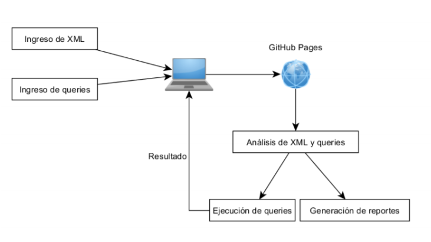

#### Universidad de San Carlos de Guatemala
#### Facultad de Ingeniería
#### Escuela de Ciencias y Sistemas
#### Organización de Lenguajes y Compiladores 2 - Sección A
#### Ing. Luis Fernando Espino Barrios
#### Aux. Haroldo Arias   
 

<table class="default">
  <tr>
    <th>Nombre</th>
    <th>Carnet</th>
  </tr>
  <tr>
    <td>Hilbert Josue Perucho Ramirez</td>
    <td>201313889</td>
  </tr>
  <tr>
    <td>Nombre</td>
    <td>Carne</td>
  </tr>
  <tr>
    <td>Nombre</td>
    <td>Carne</td>
  </tr>
</table>

 

## Índice
- [TytusX Grupo 12](#TuytusX - Proyecto de Clase) 
- [Objetivos](#Objetivos)
- [Requisitos_del_Sistema](#Requisitos_del_Sistema)
- [Componentes](#Componentes)
- [Análisis_Léxico_XML](#Analisis Lexico - Gramatica - XML)
- [Análisis_Sintáctico_XML_ASC](#Análisis_Sintáctico_XML_ASC)
- [Análisis_Sintáctico_XML_DESC](#Análisis_Sintáctico_XML_DESC)
- [Análisis_Léxico_XPATH](#Análisis_Léxico_XPATH)
- [Análisis_Sintáctico_XPATH_DESC](#Análisis_Sintáctico_XPATH_DESC)
- [Análisis_Sintáctico_XPATH_ASC](#Análisis_Sintáctico_XPATH_ASC)
- [Archivo_Entrada_XML](#Archivo_Entrada_XML)
- [Archivo_Entrada_XPATH](#Archivo_Entrada_XPATH)
- [Salida](#Salida)

 

# TuytusX - Proyecto de Clase

TytusX es un proyecto desarrollado por estudiantes el cual es un proyecto de codigo abierto, se debe de realizar un proyecto en el cual se implemente gramaticas, recorrido de gramaticas, recorridos en producciones. Para la segunda fase se debe de realizar codigo en 3 direcciones.

 

## Objetivos  
### General  
* 
Objetivo general

* 
Que el estudiante aplique la fase de analisis y sintesis de la construccion de un compilador para realizar por un lado un interprete y por otro lado un traductor a un codigo ejecutable utilizando herramientas de analisis ascendente.

### Específicos  
* 
Objetivos específicos

* 
Que el estudiante genere un analizador lexico y sintactico para construir un interprete haciendo uso de atributos heredados y sintetizados.

* 
Que el estudiante utilice tanto una gramática adecuada para el analizador ascendente y otra gramática adecuada para el analizador descendente.

* 
Que el estudiante maneje la pila o el árbol que proporciona el analizador sintáctico para simular el paso de atributos heredados.

* 
Que el estudiante implemente la ejecución de la traducción utilizando traducción dirigida por la sintaxis.

* 
Que el estudiante comprenda los conceptos acerca de traducciones.

* 
Que el estudiante traduzca el código fuente a un código de tres direcciones.

* 
Que el estudiante aplique las reglas de optimización en el código de tres direcciones previo a su ejecución.

 

## Requisitos_del_Sistema

Componentes minimos para la ejecion del proyecto:  

* Procesador Intel(R) Core(TM) i5-7200U CPU @ 2.50GHz, 2712 Mhz, 2 procesadores principales, 4 procesadores lógicos
* Javascript  
* Sistema Operativo: Windows 7 o superior.
* Entorno visual para poder realizar agregaciones o modificaciones de codigo

 

## Componentes

<h3>XML - XPATH Compilador G7</h3>

El compilador de XML aparecera en la pantalla en la parte superior donde se ingresara un archivo de entrada el cual contendra una serie de instrucciones en gramatica XML, lo que se debe de realizar es analizar dicha gramatica la cual estara unida con una gramatica que sea de tipo XPATH, al momento de ejecutar estas gramaticas debera de devolver un resultado en gramatica de tipo XML con los resultados.

  

## Analisis Lexico - Gramatica - XML

~~~

inicio: raices
    ;

raices: raices raiz
        | raiz
        ;

raiz: objeto
    ;

objeto:  '<' ID latributos '/' '>'
       | '<' ID latributos '>'  texto_libre  '<' '/' ID '>'    
       | '<' ID latributos '>'  objetos  '<' '/' ID '>'
        ;

objetos: objetos objeto
         |objeto
         ;

latributos: atributos
            |
            ;

atributos:   atributos atributo
            |atributo
            ;

atributo: ID '=' CADENA
        ;

texto_libre : texto_libre TEXTO
             | TEXTO
             ;

~~~

## Análisis_Sintáctico_XML_ASC

### Gramatica Ascendente

~~~

~~~

## Análisis_Sintáctico_XML_DESC

### Gramatica Descendente 
    
~~~

~~~

## Análisis_Léxico_XPATH

### Palabras reservadas
~~~

~~~

### Caracteres especiales

~~~

~~~

## Análisis_Sintáctico_XPATH_DESC

### Gramatica Descendente 
    
~~~

~~~

## Análisis_Sintáctico_XPATH_ASC

### Gramatica Ascendente

~~~

~~~

## Archivo_Entrada_XML

<h3>Ejemplo de Archivo Entrada:</h3>

~~~
<?xml version="1.0" encoding="UTF-8"?>
<biblioteca>
    <libro>
        <titulo>La vida está en otra parte</titulo>
        <autor>Milan Kundera</autor>
        <fechaPublicacion año="1973"/>
    </libro>
    <libro>
        <titulo>Pantaleón y las visitadoras</titulo>
        <autor fechaNacimiento="28/03/1936">Mario Vargas Llosa</autor>
        <fechaPublicacion año="1973"/>
    </libro>
    <libro>
        <titulo>Conversación en la catedral</titulo>
        <autor fechaNacimiento="28/03/1936">Mario Vargas Llosa</autor>
        <fechaPublicacion año="1969"/>
    </libro>
</biblioteca>
~~~

## Archivo_Entrada_XPATH

~~~

/biblioteca/libro

~~~

## Salida

~~~

<libro >
  <titulo >
    La vida está en otra parte
  </titulo>
  <autor >
    Milan Kundera
  </autor>
  <fechaPublicacion año="1973"/>
</libro>
<libro >
  <titulo >
    Pantaleón y las visitadoras
  </titulo>
  <autor fechaNacimiento="28/03/1936">
    Mario Vargas Llosa
  </autor>
  <fechaPublicacion año="1973"/>
</libro>
<libro >
  <titulo >
    Conversación en la catedral
  </titulo>
  <autor fechaNacimiento="28/03/1936">
    Mario Vargas Llosa
  </autor>
  <fechaPublicacion año="1969"/>
</libro>

~~~