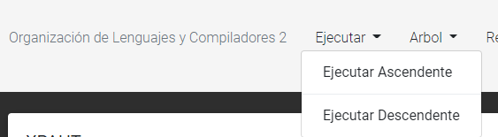
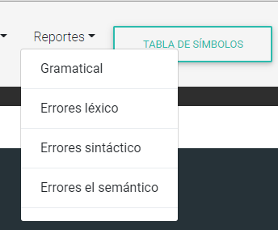
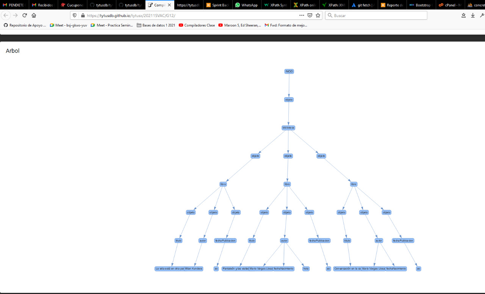
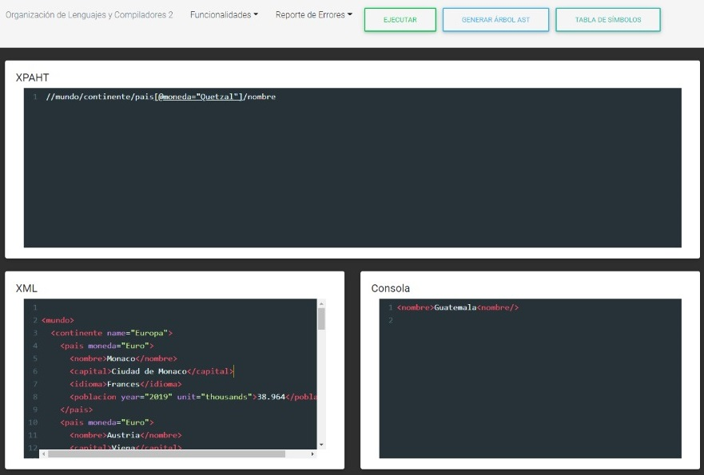
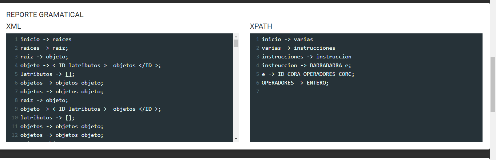

#### Universidad de San Carlos de Guatemala
#### Facultad de Ingeniería
#### Escuela de Ciencias y Sistemas
#### Organización de Lenguajes y Compiladores 2 - Sección A
#### Ing. Luis Fernando Espino Barrios
#### Aux. Haroldo Arias   
 

<table class="default">
  <tr>
    <th>Nombre</th>
    <th>Carnet</th>
  </tr>
  <tr>
    <td>Jonnathan Antonio Castillo Avendaño    (Coordinador)</td>
    <td>201314340</td>
  </tr>
  <tr>
    <td>Hilbert Josue Perucho Ramirez</td>
    <td>201313889</td>
  </tr>
  <tr>
    <td>Ricardo Humberto Fuentes Garcia</td>
    <td>201513747</td>
  </tr>
</table>

 

## Índice
- [TytusX Grupo 12](#TuytusX - Proyecto de Clase) 
- [Objetivos](#Objetivos)
- [Capturas de Pantalla](#Pantallas)

 

# TuytusX - Proyecto de Clase

TytusX es un proyecto desarrollado por estudiantes el cual es un proyecto de codigo abierto, se debe de realizar un proyecto en el cual se implemente gramaticas, recorrido de gramaticas, recorridos en producciones. Para la segunda fase se debe de realizar codigo en 3 direcciones.

 

## Objetivos  
### General  
* 
Objetivo general

* 
Que el estudiante aplique la fase de analisis y sintesis de la construccion de un compilador para realizar por un lado un interprete y por otro lado un traductor a un codigo ejecutable utilizando herramientas de analisis ascendente.

### Específicos  
* 
Objetivos específicos

* 
Que el estudiante genere un analizador lexico y sintactico para construir un interprete haciendo uso de atributos heredados y sintetizados.

* 
Que el estudiante utilice tanto una gramática adecuada para el analizador ascendente y otra gramática adecuada para el analizador descendente.

* 
Que el estudiante maneje la pila o el árbol que proporciona el analizador sintáctico para simular el paso de atributos heredados.

* 
Que el estudiante implemente la ejecución de la traducción utilizando traducción dirigida por la sintaxis.

* 
Que el estudiante comprenda los conceptos acerca de traducciones.

* 
Que el estudiante traduzca el código fuente a un código de tres direcciones.

* 
Que el estudiante aplique las reglas de optimización en el código de tres direcciones previo a su ejecución.

 

## Pantallas

<h3>Capturas de Pantalla</h3>

A continuacion se muestra una serie de capturas de pantallas, el cual muestra la funcionalidad de dicho proyecto, se muestran los reportes, y manera de uso. 

<h3>Encabezado</h3>

En el encabezado muestra una serie de botones, los cuales tienen diferentes funcionalidades en los cuales podemos encontrar el compilar las gramaticas de manera ascendente y descendente, generacion de reportes y demas funcionalidades 

  

<h3>Reportes</h3>

En los reportes podemos encontrar varios, se debe de ingresar una entrada en el apartado de XML y en el XPATH para poder obtener los reportes 

  

  

<h3>Ejecucion de Codigo</h3>

En la ejecucion de codigo se analiza cada una de las entradas y devuelve el resultado de lo que se envia por medio de la entrada del XPATH

  

<h3>Reporte Gramatical</h3>

En el reporte gramatical, despliega la gramatica que se va ejecutando al momento que va leyendo la entrada del archivo

  

