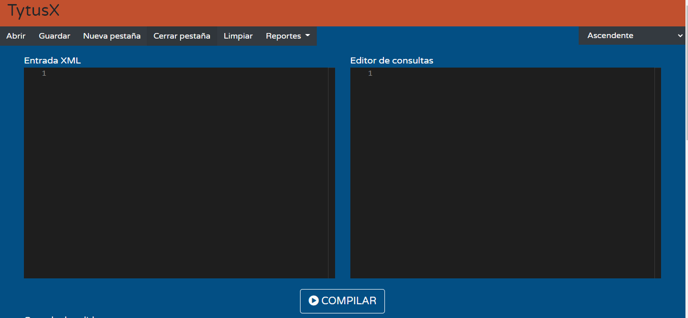
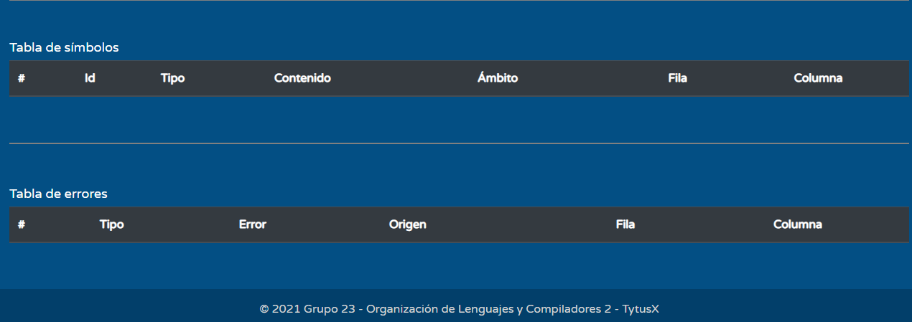
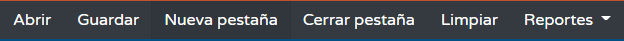
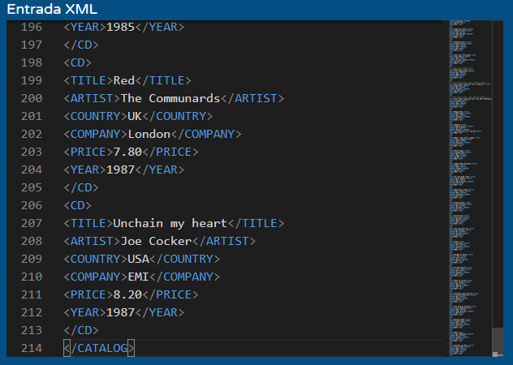
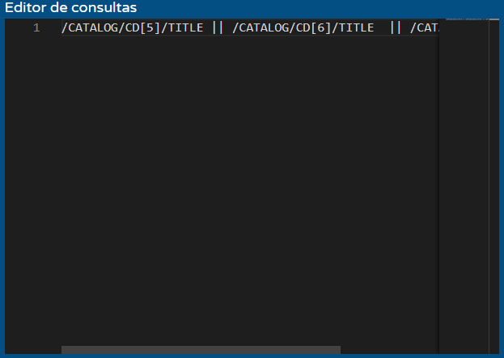
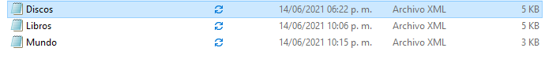
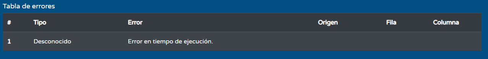

# MANUAL DE USUARIO

## Introducción
El siguiente manual tiene como fin introducir al usuario al manejo y conocimiento de TYTUS para su uso funcional.  

### __Typesty__

## Ventana principal

  

En ella el usuario puede acceder a cada una de las funcionalidades de la aplicación y visualizar los reportes de símbolos y errores.

 

  

En ella el usuario puede acceder a los reportes que se generarán a partir de la compilación, Simbolos y Errores.

  

  

Barra de herramientas con varias opciones para que el usuario opciones variadas al momento de ejecutar el programa o seleccionar algun tipo de diagrama
  

  

Esta barra le permitira al usuario cambiar el tipo de analizadores que se utilizaran al momento de compilar el programa, los analizadores son ascendente y descendente.
  

  

Panel de texto donde el usuario podrá ingresar sus archivos xml o bien escribir uno desde cero.
  

  

En este panel el usuario ingresa las consultas que desea realizar implementando el lenguaje xpath
  

  

Consola de salida donde se brindará el resultado de la codificación del intérprete con cadenas resultantes según el código ingresado en los editores de texto antes mencionados.
  

## Funciones

### Compilar
Al hacer clic en este botón se realizará un análisis y procesamiento por parte del intérprete que devolverá el resultado en la consola y tablas correspondientes.
  

### Abrir

  

Permite cargar en el editor un archivo .ty
  

### Guardar

  

Permite guardar en la computadora un archivo .ty
  

### Nueva pestaña
Abre una pestaña nueva dentro del explorador para tener más editores abiertos.
  

### Cerrar pestaña
Elimina la pestaña seleccionada del navegador.
  

### Limpiar
Esta opcion lo que hace es limpiar todo el contenido que este dentro de los cuadros de texto.
  
### Reportes
Esta opcion mostrar una sublista, esta contendra las opciones de AST, CST y DAG, opciones distintas de reporte para verficar como trabajo la gramatica el programa.

 

 

### Manejo de errores:

Es frecuente que puedan ocurrir ciertos errores al momento de ingresar datos y manejar las funciones del administrador, para ello se le retornará una tabla de errores dento del html con todos los errores tanto léxicos como sintácticos y semánticos para informar sobre el error.

  

Tabla de errores léxicos, sintácticos y semánticos en forma de tabla en caso se detecten a partir del código fuente.
  

  

## Comentarios:
Los comentarios son una forma elegante de indicar que función tiene cierta sección del código que se ha escrito simplemente para dejar algún mensaje en específico. cada lenguaje tiene sus formas para los comentarios:

- Comentarios en XML: Estos comentarios deberán comenzar con <!-- y terminar -->.
- Comentarios en Xpath: Estos comentarios deberán comenzar con (: y terminar con :).
 
