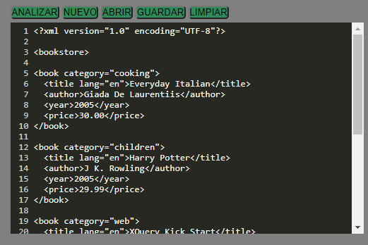
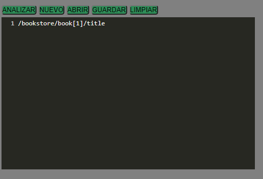
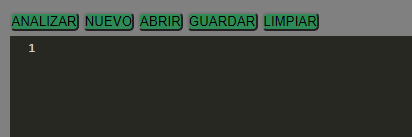
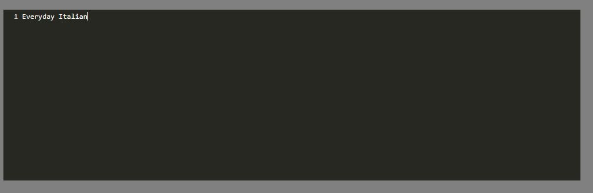

### Universidad de San Carlos de Guatemala
### Facultad de Ingeniería
### Escuela de Ciencias y Sistemas
### Organización de Lenguajes y Compiladores 2 
### Vacaciones junio 2021 - Sección A
### Ing. Luis Fernando Espino Barrios
### Aux. Haroldo Arias

### MANUAL DE USUARIO

## -----------------------------------------Proyecto: TytusX-----------------------------------------

 

<table class="w3-table">
  <tr>
    <th>Nombre</th>
    <th>Carnet</th>
  </tr>
  <tr>
    <td>Cristian Alexander Gomez Guzman</td>
    <td>201801480</td>
  </tr>  
  <tr>
    <td>Elder Aquilino Tojin</td>
    <td>201020445</td>
  </tr>
</table>

 

## Índice
- [Introducción](#Introducción) 
- [Segmentos](#Segmentos)
- [Opciones de segmentos](#Segmento_de_opciones)
- [Resultado](#Resultado_del_query)

 

# Introducción

TytusX es un administrador de bases de datos documental de código abierto desarrollado bajo licencia MIT que utilizará lenguaje JavaScript para su construcción. Soportará archivos XML y manejará los lenguajes de consultas XPath y XQuery.
 

    

 

 

## Segmentos 

* ### Segmento numero 1: 
Este segmento sera utilizado para editar el archivo XML.

    

* ### Segmento numero 2: 
Este segmento sera utilizado para editar la consulta o las consultas a escribir, esta puede tener la sintaxis tanto de XPath como de XQuery

    

 
 
Cada segmento tiene las siguientes opciones:

## Segmento_de_opciones 

    

* ### Nuevo: 
Esta opción permite crear un editor nuevo.
* ### Abrir: 
Esta opción permite abrir cualquier archivo que contenga texto plano, y crea una nueva pestaña con el contenido del archivo.
* ### Guardar
Esta opción es para guardar un archivo.
* ### Limpiar
Esta opción limpia los editores y la consola de resultado.
 

## Resultado_del_query 

Este segmento sirve para mostrar el resultado del query o de los queries.
 
 

  

 
