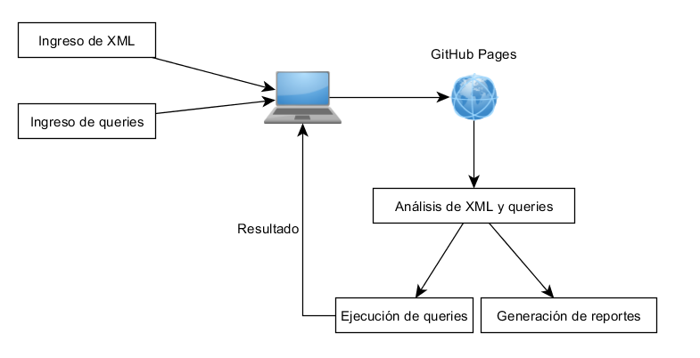

### Universidad de San Carlos de Guatemala
### Facultad de Ingeniería
### Escuela de Ciencias y Sistemas
### Organización de Lenguajes y Compiladores 2 
### Vacaciones junio 2021 - Sección A
### Ing. Luis Fernando Espino Barrios
### Aux. Haroldo Arias

### MANUAL TÉCNICO

## -----------------------------------------Proyecto: TytusX-----------------------------------------

 

<table class="w3-table">
  <tr>
    <th>Nombre</th>
    <th>Carnet</th>
  </tr>
  <tr>
    <td>Cristian Alexander Gomez Guzman</td>
    <td>201801480</td>
  </tr>  
  <tr>
    <td>Elder Aquilino Tojin</td>
    <td>201020445</td>
  </tr>
</table>

 

## Índice
- [Introducción](#Introducción) 
- [Objetivos](#Objetivos)
- [Gramática xml](#Gramática_xml)
- [Gramática xpath](#Gramática_xpath)

 

# Introducción

Se debe construir un parser de XML y un parser e intérprete de XPath; tambien se debe agregar el parser e intérprete de XQuery.
 

    

 

 

## Objetivos 

<li>
Aplicar la fase de análisis y síntesis de la construcción de un compilador para realizar por un lado un intérprete y por otro lado un traductor a un código ejecutable utilizando herramientas de análisis ascendente.
</li>
<li>
Se debe utilizar GitHub Pages para mostrar el funcionamiento de la aplicación Web.
</li>

## Gramática_xml 

* ### Análisis lexico: 

<h3>Alfabeto:</h3>
<code>

    Simbolos= <!--  [ \r\t]+ / < > _
    Letras = A-Z, a-z _ñÑ
    Digitos = 0 - 9, 0.0 - 9.0 

</code>

<h3>Tokén:</h3>
<code>

    reservadas = (
        xml
        encoding
        version
    )

</code>

* ### Análisis sintactico:

<h3>Gramática:</h3>
<code>
    ESTRUCTURA : 
        ESTRUCTURA ROOT
    |   ROOT
    ;

    ROOT : 
        menorQ interrogacion xml version igual cadena encoding igual cadena interrogacion mayorQ     
    |   menorQ identificador mayorQ LISTA_ELEMENTOS menorQ slash identificador mayorQ           
    ;

    LISTA_ELEMENTOS :  
        LISTA_ELEMENTOS ELEMENTO    
    |   ELEMENTO                               
    ;   

    ELEMENTO : 
        menorQ identificador mayorQ Texto menorQ slash identificador mayorQ                        
    |   menorQ identificador mayorQ LISTA_ELEMENTOS menorQ slash identificador mayorQ                 
    |   menorQ identificador LISTA_ATRIBUTO mayorQ LISTA_ELEMENTOS menorQ slash identificador mayorQ  
    |   menorQ identificador LISTA_ATRIBUTO mayorQ Texto menorQ slash identificador mayorQ            
    |   menorQ identificador LISTA_ATRIBUTO slash mayorQ                                              
    |   menorQ identificador slash mayorQ                                                             
    ;

    LISTA_ATRIBUTO : 
        ATRIBUTOS                         
    |                                              
    ;

    ATRIBUTOS:
        ATRIBUTOS ATRIBUTO                             
    |   ATRIBUTO                                   
;

    ATRIBUTO : 
        identificador igual cadena           
    ;
</code>

## Gramática_xpath

<h3>Alfabeto:</h3>
<code>

    Simbolos = , ! < > = | + - * / : . @ [ ] ( ) { } " ' $ % #  div 
    Letras = A-Z, a-z _ñÑ
    Digitos = 0 - 9, 0.0 - 9.0 

</code>

<h3>Tokén:</h3>
<code>

    reservadas = (      
      for 
      let 
      some 
      every 
      if 
      or 
      and 
      eq 
      ne 
      lt 
      le 
      gt 
      ge 
      to 
      div 
      idiv 
      mod 
      union 
      except 
      instance
      of
      treat
      castable
      cast
      return
      in
      satisfies
      then
      else
      child
      descendant
      attribute
      self
      descendant-or-self
      following-sibling
      following
      namespace
      parent
      ancestor
      preceding-sibling
      preceding-sibling
      preceding
      ancestor-or-self
      function
      map
      array
      empty-sequence
      item
      node
      text
      document-node
      comment
      namespace-node
      processing-instruction
      schema-attribute
      element
      schema-element
      ?
      Q
      x
      y
      not

</code>

* ### Análisis sintactico:

<h3>Gramática:</h3>
<code>

      
INICIO :
LISTA_NODE EOF 
    ;

LISTA_NODE:  LISTA_NODE PATH 
    |   PATH           
    | error
;

PATH : NODE EXPR  
    |  NODE WILDCARD
    |  EXPR         
    |  NODE AXES EXPR 
    |  AXES EXPR      
;

NODE:   t_doble_diagonal 
    |   t_diagonal       
;

EXPR: StringLiteral            
    | t_arroba StringLiteral   
    | t_doble_punto            
    | t_punto                  
    | PREDICATES               
;

WILDCARD:   t_multiplicacion   
    | t_arroba t_multiplicacion
    | node                     
;

AXES :  ancestor t_doble_dos_puntos         
    |   t_ancestor_or_self t_doble_dos_puntos 
    |   t_attribute t_doble_dos_puntos        
    |   t_child t_doble_dos_puntos            
    |   t_descendant t_doble_dos_puntos       
    |   t_following t_doble_dos_puntos        
;

PREDICATES : StringLiteral t_corchete_izquierdo EXPRESION t_corchete_derecho {$$ = new Predicado($1,$3,this._$.first_line, this._$.first_column);}
;

EXPRESION : 
	// Aritmeticas
	  EXPRESION t_suma EXPRESION		       
	| EXPRESION t_resta EXPRESION		       
	| EXPRESION t_multiplicacion EXPRESION		
	| EXPRESION t_div EXPRESION	                
	| EXPRESION t_igual EXPRESION	            
	| t_parentesis_izquierdo EXPRESION t_parentesis_derecho	
	| PRIMITIVO					
	;

PRIMITIVO : 
	  number 	      
	| cadena		  
	| StringLiteral   
	| t_arroba StringLiteral  
	;

ESPECIAL: 
;

</code>

