# Manual De Usuario

Manual de instrucciones tecnicas internas del proyecto TytusX.

## Interfaz

Para iniciar el proyecto se desplegara la pagina con la siguiente interfaz.

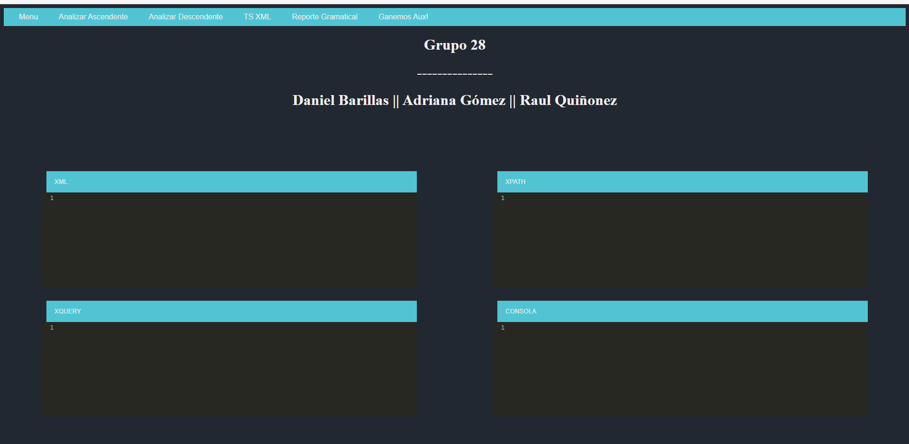

## Opciones
### Uso Basico

Antes de Realizar cada accion se recomienda seleccionar la pestaña en la cual se quiere actuar, activandola de esta manera:

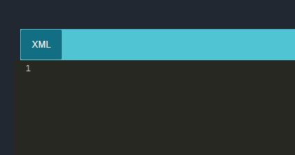

### Menu

Dentro de menu apreciamos el boton Guardar (Actualmente desactivado) para poder hacer una copia del archivo dentro del panel que estemos seleccionando.

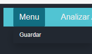

### Analizar Ascendente y Analizar Descendente

Estos botones serviran para poder activar el analizador, dando 2 opciones al momento de realizar la funcion, ya sea de manera asecendente o descendente (siemmpre dentro de la pestaña seleccionada).

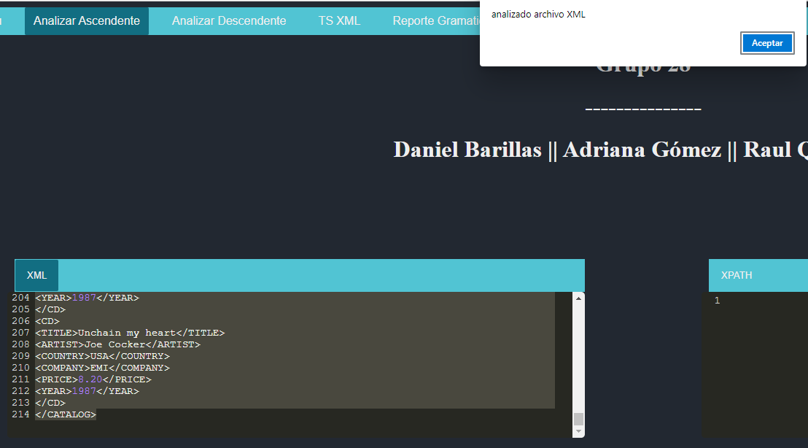

### TS XML

Este boton contiene la tabla de simbolos dependiendo de la gramatica usada, ya se ascendente o descendente, mediante el analisis especificamente del lenguaje XML.

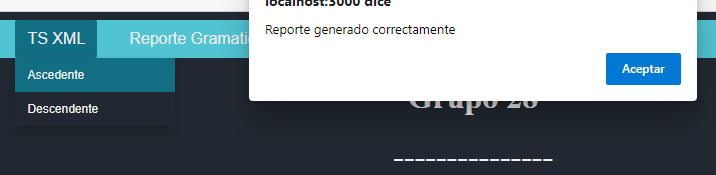

Seguido de esto se realizara la descarga de la tabla en formato html:

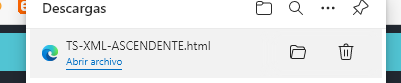

De la Siguiente forma:

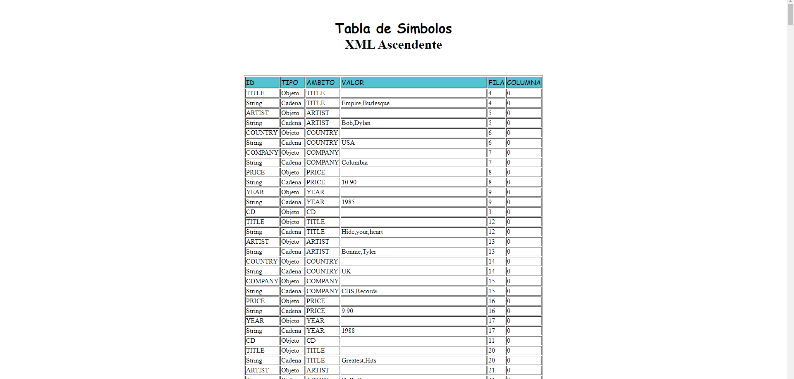

### Reporte Gramatical

Este boton genera reportes lexicos y sintacticos de acuerdo al analisis realizado especificamente del lenguaje XML.

# Manual Tecnico

## Installation

Descarga de la carpeta de desarrollo y seguido de esto se ocupa el comando:

```bash
npm install
```

Para instalacion de todos los componentes.

## Uso

Para iniciar el proyecto se ocupa el comando:

```bash
npm start
```

## Carpetas

Dentro de nuestro proyecto tendremos la Carpeta SRC en la cual estara alojado el codigo fuente base para la edicion del proyecto, compuesto por:

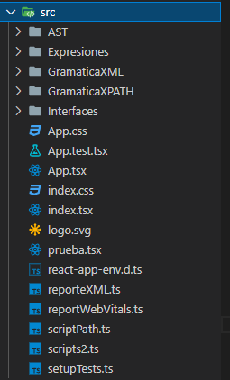

- Carpeta AST: Gestion de generacion de arbol AST.
- Carpeta Expresiones: Gestion de estructuras base para analisis tanto XML como XPATH, para guardar datos en objetos.
- Carpeta GramaticaXML: Gramaticas Ascendente y Descendente de XML en formato JISON y format JS generado por la herramienta JISON.
- Carpeta GramaticaXPATH: Gramaticas Ascendente y Descendente de XPATH en formato JISON y format JS generado por la herramienta JISON.
- Carpeta Interfaces: Generacion base de las estructuras.

## Archivos

Los Archivos en ejecucion del codigo tanto front como el uso de las interfaces y las gramaticas: 


Archivo App.tsx , El cual esta compuesto por:

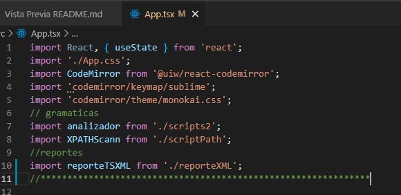

Imports Generales:

- Herramienta CodeMirror (para las pestañas)
- analizador (archivo de scripts2 para realizar analisis XML) por medio del metodo "ejecutarCodigo"

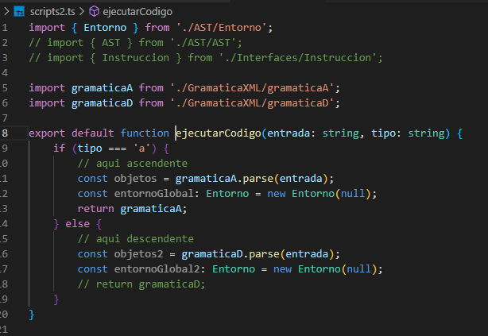

- XPATHScann (archivo de scriptOath para analisis XPATH) por medio del metodo "ejecutarCodigo"

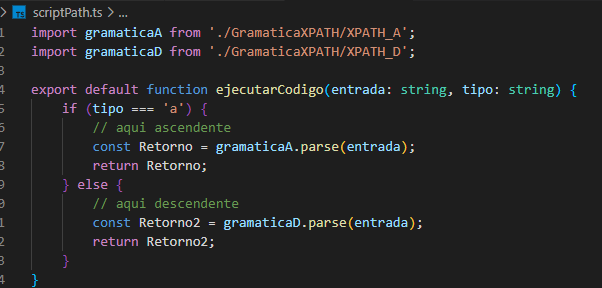

- reporteTSXML para generacion de reportes XML , haciendo uso de las gramaticas realizadas en JISON

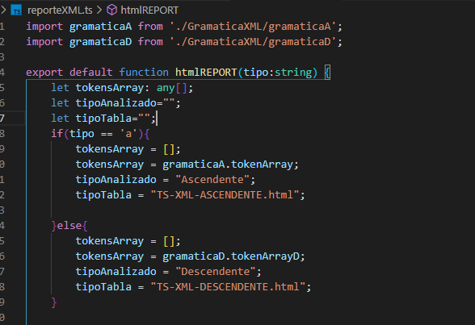


## Gramaticas

- Ascedente XML

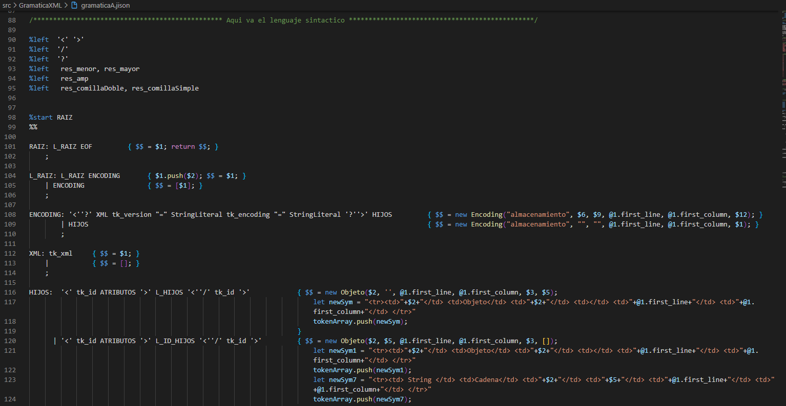

- Descendente XML

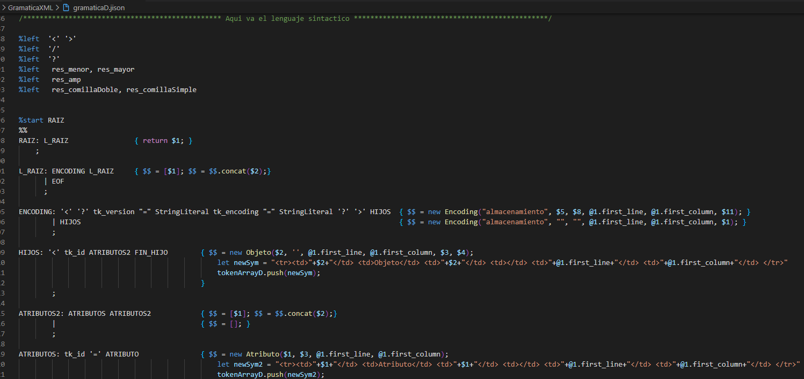

- Ascedente XPATH

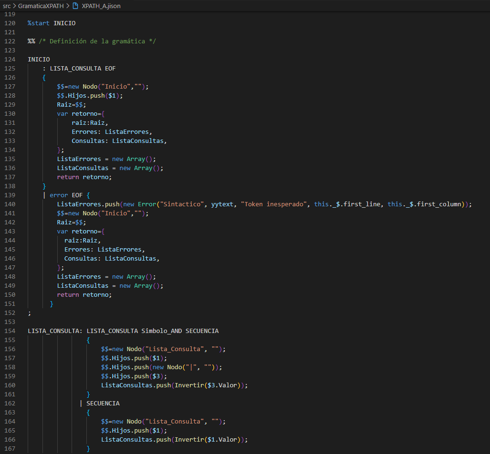

- Descendente XPATH

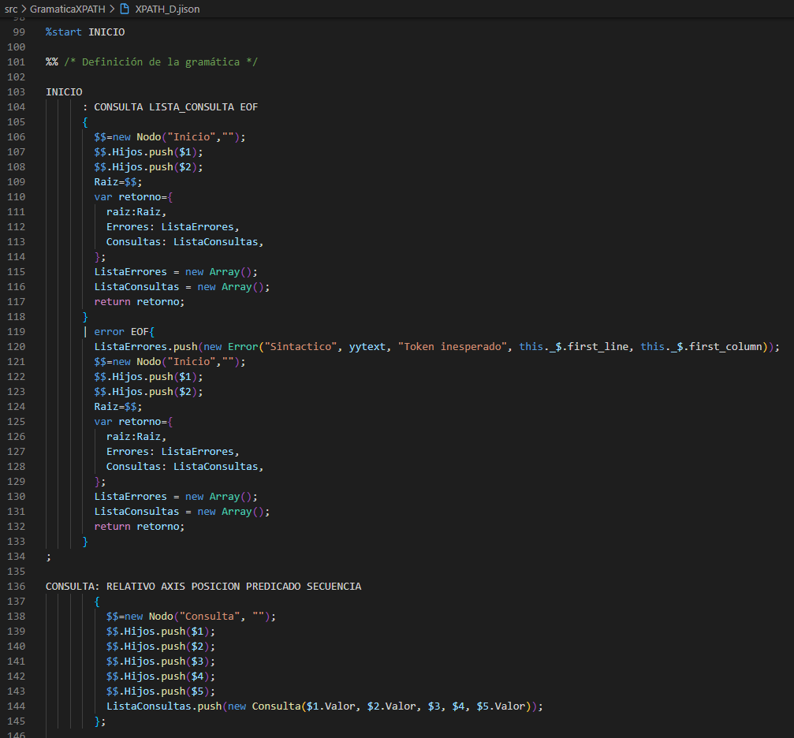

## Data interna
- Grupo Numero 28 

## License
[MIT](https://choosealicense.com/licenses/mit/)