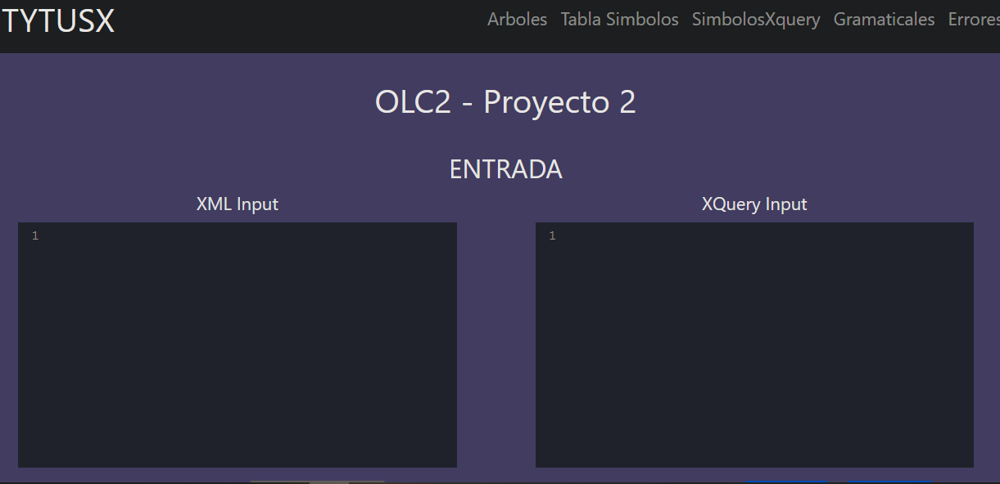
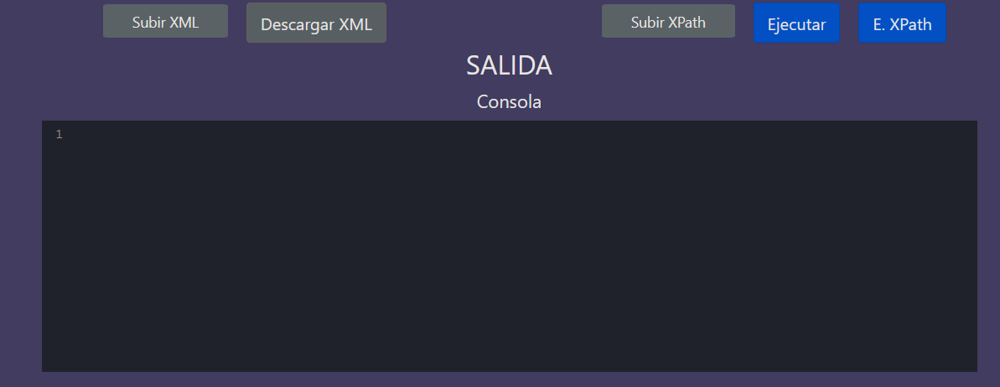
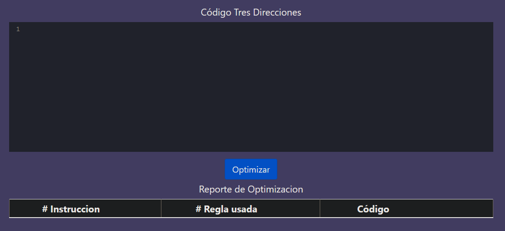

# MANUAL DE USUARIO

### LINK A LA PAGINA: https://tytusdb.github.io/tytusx/20211SVAC/G30/index.html

 
 
## Componentes de la Interfaz 

La aplicación cuenta con una interfaz intuitiva, algunos de sus componentes listados a continuación:
 1. **Barra superior de pestañas**: en la parte superior se tienen diversas pestañas con distintas funcionalidades que podrán ser de utilidad para el usuario.
 2. **XML FILE**: esta pestaña le permite analizar el texto en el editor XML, asi como limpiar su contenido o descargarlo.
 3. **XPATH FILE**: esta pestaña le permite analizar el texto en el editor XPATH, asi como limpiar su contenido o descargarlo.
 4. **SELECCIONAR ARCHIVO**: podra importar al editor de código cualquier archio con extensión .xml ó .txt que haya guardado previamente, o que desee probar.
 5. **Editor de lenguaje XML**: espacio de trabajo para codigo xml.
 6. **Editor de lenguaje XPATH**: espacio de trabajo para codigo xpath.
 7. **Consola**: podrá visualizar la salida de las consultas realizadas.
 8. **Reporte Gramatical**: podrá visualizar el listado de erres léxicos, sintácticos y semánticos.
 9. **CST Y AST**: cada reporte se muestra en un apartado con la opción de zoom.
 10. **Consola y reportes de optimización**: donde sue muestra la regla usada para la optimización y 

    

 

    

 

    
    
 Interfaz y sus componentes 

