# Manual de Usuario TytusX - Grupo 31

## **Contenido**
- [Fase 1](#idFase1)
    - [Descripcion General](#idDescripcion)
    - [Interfaz Grafica](#idInterfaz)
    - [Uso App Web](#idUsoApp)
- [Fase2](#idFase2)
    - [Descripcion General Fase 2](#idDescripcion2)
    - [Interfaz Grafica Fase 2](#idInterfaz2)
    - [Uso App Web Fase 2](#idUsoApp2)  

## FASE 1 <a name="idFase1">

## **Descripción General** <a name="idDescripcion"></a>

Tytus X es un administrador de bases de datos documental de codigo abierto. Soporta archivos de tipo XML y maneja los lenguajes de consultas de XPath y XQuery. 

## **Interfaz Gráfica** <a name="idInterfaz"></a>

La interfaz grafica cuenta con dos editores de texto uno para el archivo a utilizar de consulta de tipo XML y el otro editor para la consulta en XPath 

<div align="center">
    
    <p align="center">Editores de XML Y XPath </p>
</div>

Seguidamente tenemos un conjunto de pestañas para poder visualizar los reportes de cada uno de los analizadores de XML y XPath. 

<div align="center">
    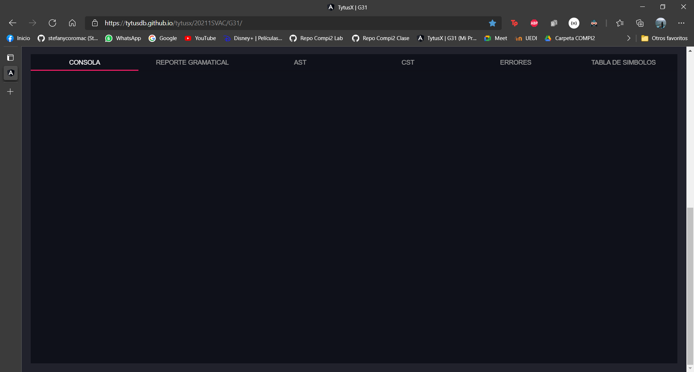
    <p align="center">Reportes </p>
</div>

## **Uso de la aplicación** <a name="idUsoApp"></a>

### Pasos para la ejecución 

1. Ingresa un archivo de entrada en el editor de XML. 

#### Ejemplo de Entrada de un archivo XML 

```bash
< ? xml version="1.0" encoding="UTF-8"?>
<bookstore>
  <!-- Esto es un comentario -->
  <book category="cooking">
    <title lang="en">Everyday Italian</title>
    <author>Giada De Lau&amp;rentiis</author>
    <year>2005</year>
    <price>30.00</price>
  </book>

  <book category="children">
    <title lang="en">Harry Potter</title>
    <author>J K. Rowling</author>
    <year>2005</year>
    <price>29.99</price>
  </book>

  <book category="web">
    <title lang="en">XQuery Kick Start</title>
    <author>James &quot; McGovern</author>
    <author>Per &lt; Bothner</author>
    <author>Kurt Cagle</author>
    <author>James Linn</author>
    <author>Vaidyanathan Nagarajan</author>
    <year>2003</year>
    <price>49.99</price>
  </book>

  <book category="web" cover="paperback">
    <title lang="en">Learning XML</title>
    <author>Erik T. Ray</author>
    <year>2003</year>
    <price>39.95</price>
  </book>
</bookstore>
```

- En el editor de XML se encuentra la opción de realizar el análisis Ascendente y Descendente de la entrada XML. 

2. Elige el analizador a utilizar para el archivo de entrada. 

<div align="center">
    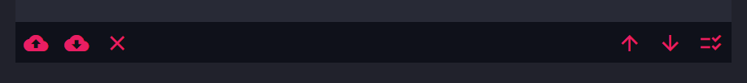
    <p align="center"> Botones de Analisis Ascendente y Descendente </p>
</div>

3. Visualiza los reportes generador por el analizador, si la entrada es correcta se mostraran los reportes de Arbol CST, Tabla de Simbolos y Reporte Gramatical de la entrada. 

#### Análisis Ascendente de XML 

La entrada pasa por un analizador Ascendente y devuelve un arbol CST y una tabla de simbolos para poder trabajar con la información que se reconocio en el archivo de XML. 

##### Reporte Árbol CST - XML 

- Ejemplo de Arbol CST generado para un archivo XML, este reporte se muestra si el archivo no contiene errores. 

<div align="center">
    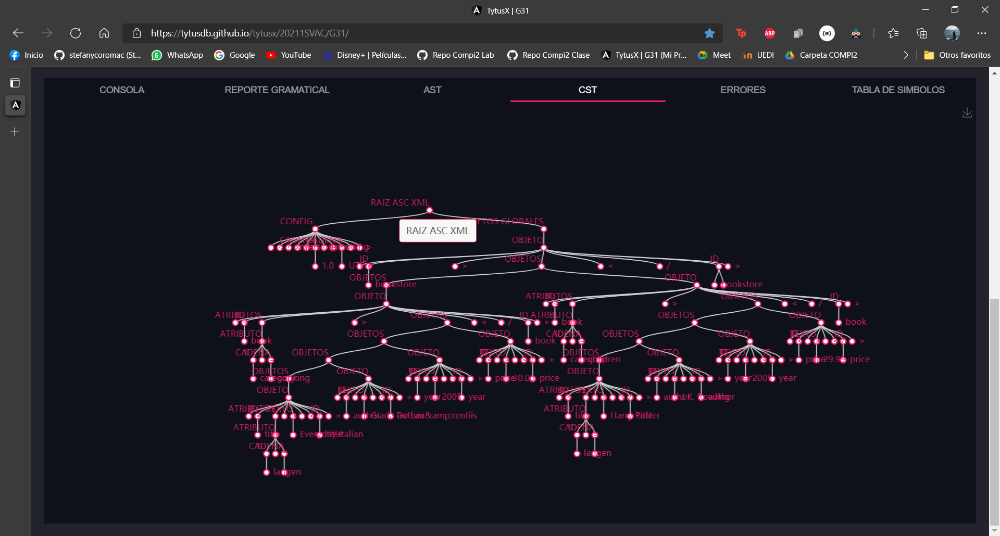
    <p align="center"> Arbol CST  </p>
</div>

##### Reporte Tabla de Simbolos 

- Ejemplo de tabla de símbolos generada para un archivo XML, este reporte se muestra si el archivo no contiene errores. 

<div align="center">
    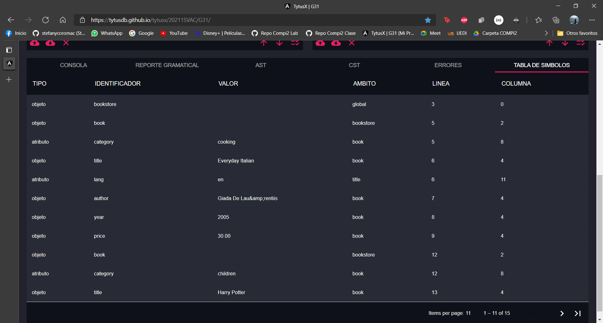
    <p align="center"> Tabla de Símbolos  </p>
</div>

##### Reporte Gramatical 
- Ejemplo de reporte gramatical ascendente de la entrada, este se muestra si la entrada no contiene errores. 

<div align="center">
    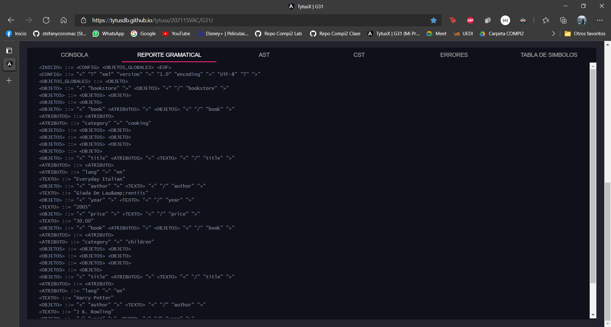
    <p align="center"> Reporte Gramatical Ascendente </p>
</div>

##### Reporte de Errores Léxicos, Sintácticos y Semánticos 

- Ejemplo de Reportes generados si el archivo de entrada contiene errores. 

<div align="center">
    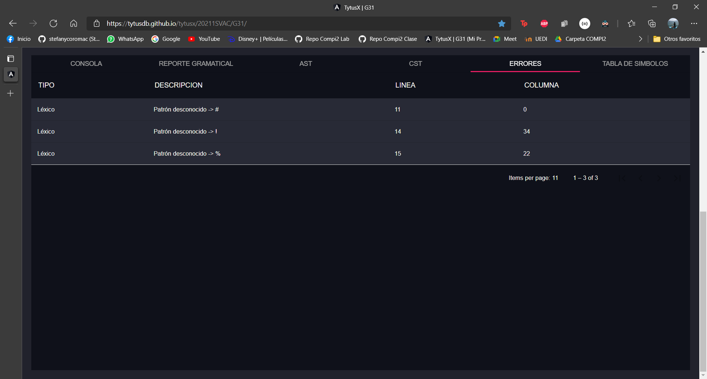
    <p align="center"> Errores Encontrados </p>
</div>

#### Analisis Descendente de XML 

La entrada pasa por un analizador Descendente y devuelve un arbol CST y una tabla de simbolos para poder trabajar con la información que se reconocio en el archivo de XML. 

##### Reporte Árbol CST - XML 

- Ejemplo de Arbol CST generado para un archivo XML, este reporte se muestra si el archivo no contiene errores. 

<div align="center">
    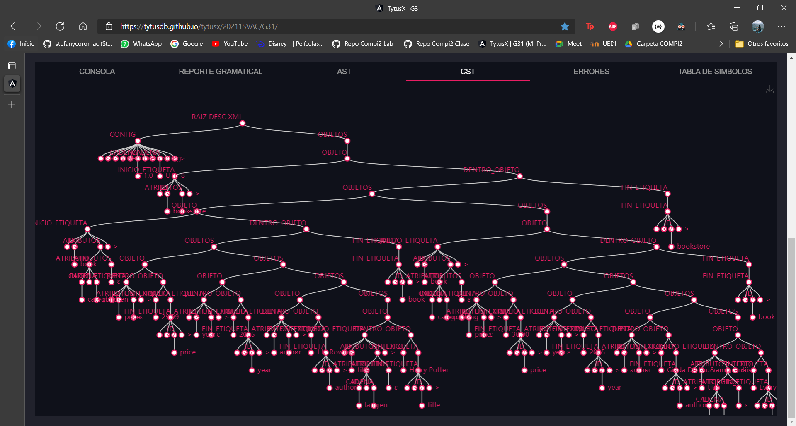
    <p align="center"> Árbol CST  </p>
</div>

##### Reporte Tabla de Símbolos 

- Ejemplo de tabla de símbolos generada para un archivo XML, este reporte se muestra si el archivo no contiene errores. 

<div align="center">
    
    <p align="center"> Tabla de Símbolos  </p>
</div>

##### Reporte Gramatical 
- Ejemplo de reporte gramatical descendente de la entrada de XML, este se muestra si la entrada no contiene errores. 

<div align="center">
    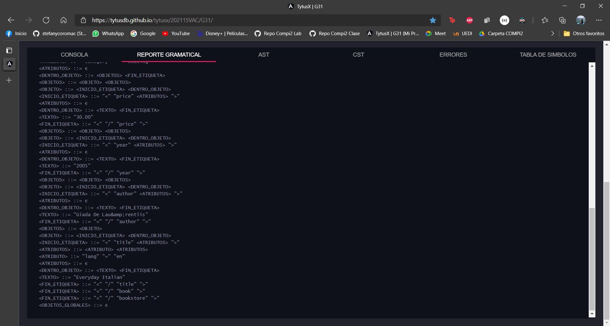
    <p align="center"> Reporte Gramatical Descendente </p>
</div>

##### Reporte de Errores Léxicos, Sintácticos y Semánticos 

- Ejemplo de Reportes generados si el archivo de entrada contiene errores. 

<div align="center">
    
    <p align="center"> Errores Encontrados </p>
</div>


4. Ingresa en el editor de XPATH una Consulta 

#### Ejemplo de consultas para XPATH

```bash
/bookstore/book/title
/bookstore/book[1]/title
/bookstore/book/price[text()]
/bookstore/book[price>35]/price
```

- En el editor de XPATH se encuentran las opciones para poder ejecutar un análisis ascendente o descendente. 

5. Se procede a ejecutar la consulta con el analizador correspondiente. 

#### Análisis Ascendente de XPATH 

La entrada pasa por un analizador ascendente y devuelve un árbol CST, un árbol AST y un reporte gramatical de como reconocio la consulta por el analizador.  

##### Reporte Árbol CST - XPATH 

- Ejemplo de árbol CST generado para una consulta de XPATH, este reporte se muestra si la entrada no contiene errores. 

<div align="center">
    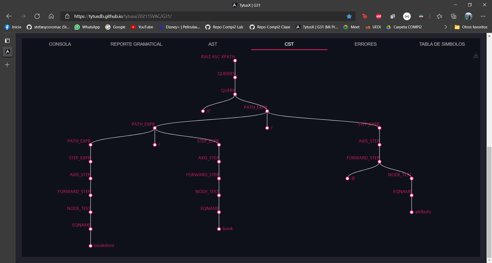
    <p align="center"> Arbol CST  </p>
</div>

##### Reporte Árbol AST - XPATH  

- Ejemplo de árbol AST generado para una consulta en XPATH, este reporte se muestra si la entrada no contiene errores. 

<div align="center">
    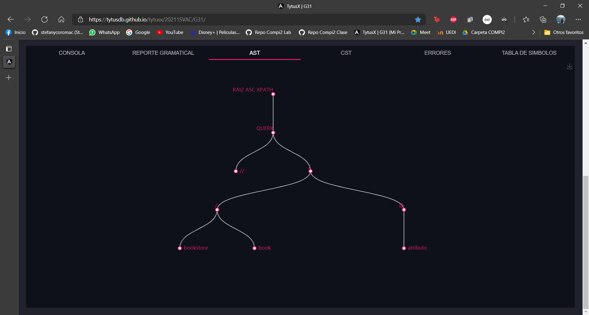
    <p align="center"> Árbol AST  </p>
</div>

##### Reporte Gramatical 
- Ejemplo de reporte gramatical ascendente de la consulta en XPATH, este se muestra si la entrada no contiene errores. 

<div align="center">
    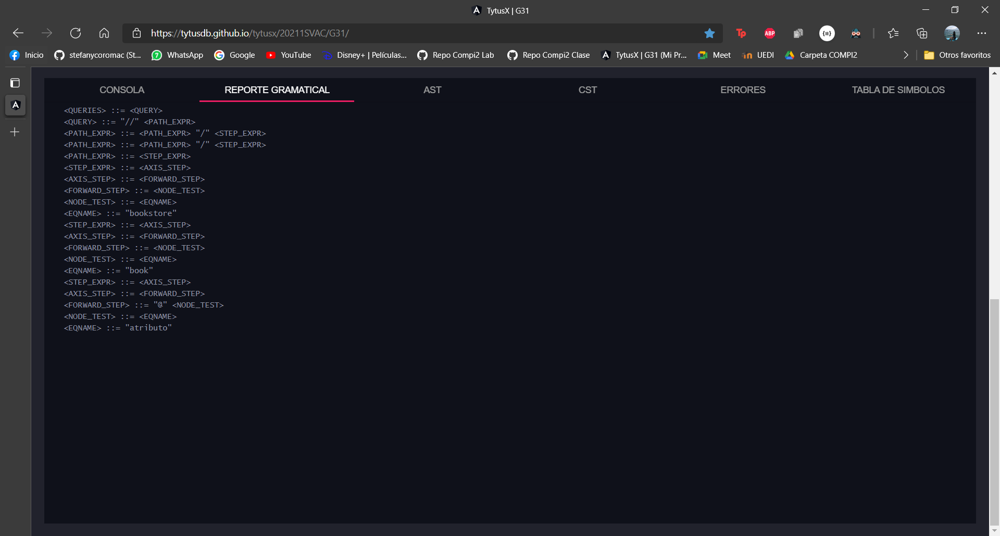
    <p align="center"> Reporte Gramatical Ascendente </p>
</div>


##### Reporte de Errores Léxicos, Sintácticos y Semánticos 

- Ejemplo de Reportes generados si el archivo de entrada contiene errores. 

<div align="center">
    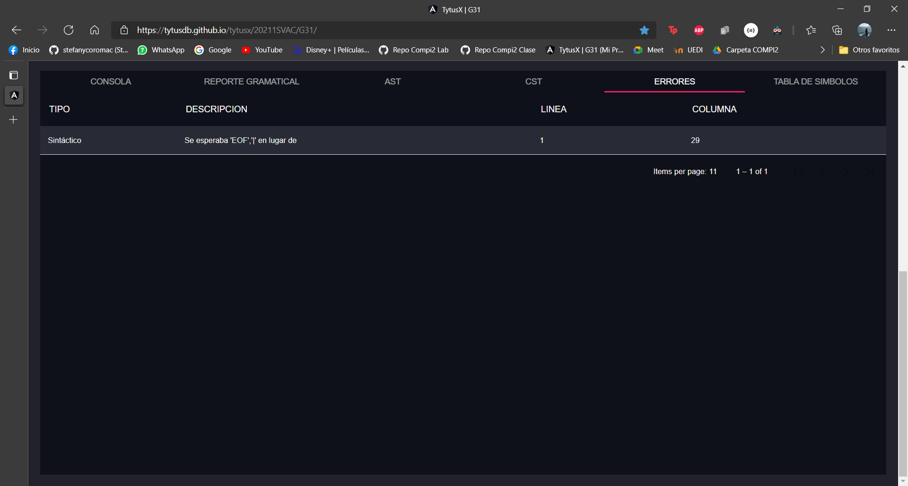
    <p align="center"> Errores Encontrados </p>
</div>

#### Análisis Descendente de XPATH

La entrada pasa por un analizador descendente y devuelve un árbol CST, un árbol AST y un reporte gramatical de como reconocio la consulta por el analizador.  

##### Reporte Arbol CST - XPATH 

- Ejemplo de árbol CST generado para una consulta de XPATH, este reporte se muestra si la entrada no contiene errores. 

<div align="center">
    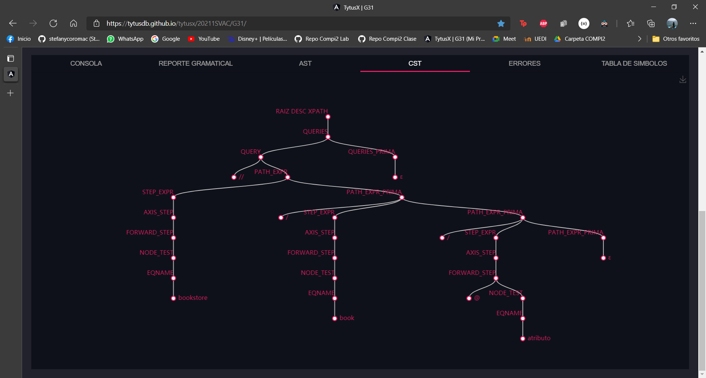
    <p align="center"> Arbol CST  </p>
</div>

##### Reporte Árbol AST - XPATH  

- Ejemplo de árbol AST generado para una consulta en XPATH, este reporte se muestra si la entrada no contiene errores. 

<div align="center">
    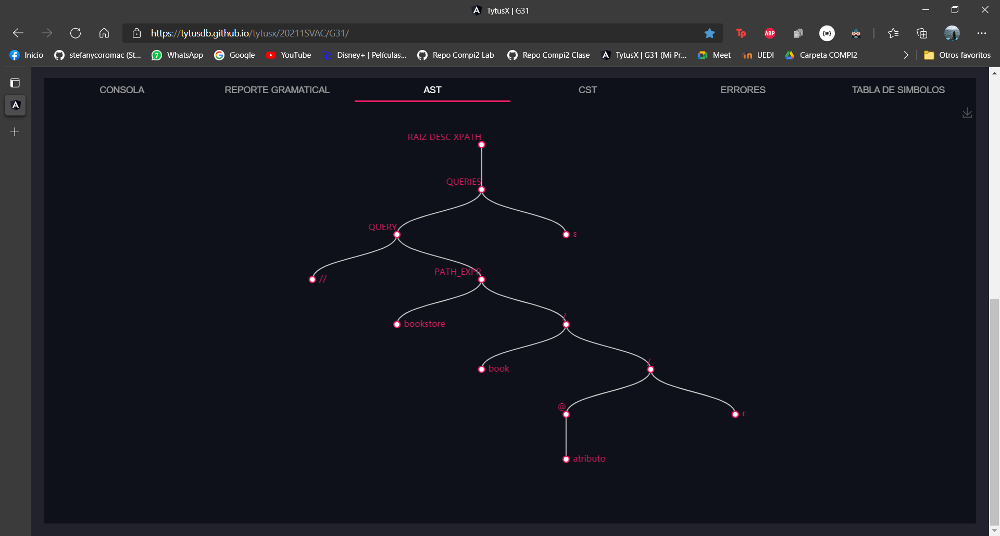
    <p align="center"> Árbol AST  </p>
</div>

##### Reporte Gramatical 
- Ejemplo de reporte gramatical descendente de la consulta en XPATH, este se muestra si la entrada no contiene errores. 

<div align="center">
    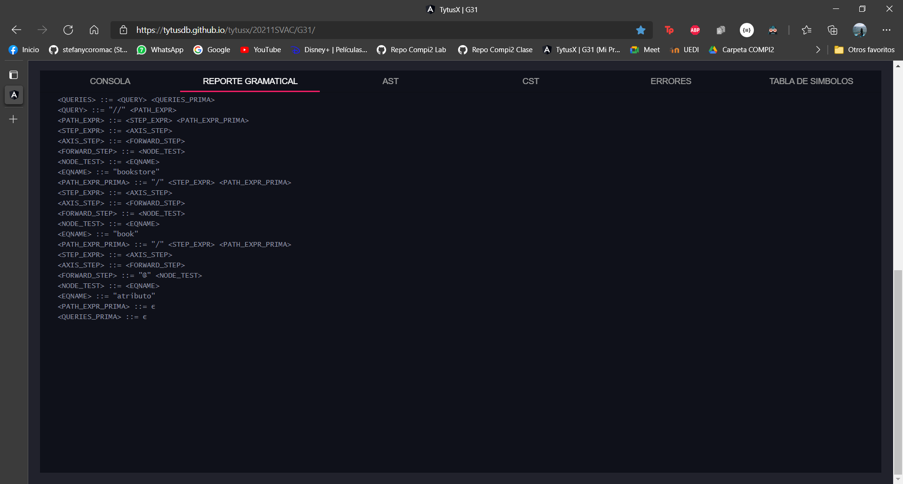
    <p align="center"> Reporte Gramatical Ascendente </p>
</div>

##### Reporte de Errores Léxicos, Sintácticos y Semánticos 

- Ejemplo de Reportes generados si el archivo de entrada contiene errores. 

<div align="center">
    
    <p align="center"> Errores Encontrados </p>
</div>

6. Si la ejecución del archivo XML y la consulta en XPATH es correcta se procede a mostrar el resultado en el apartado de consola. 

<div align="center">
    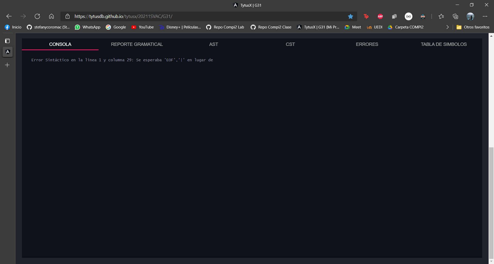
    <p align="center"> Consola </p>
</div>

7. Fin de la ejecución del programa. 

## FASE 2 <a name="idFase2">

## **Descripción General** <a name="idDescripcion2"></a>

Tytus X es un administrador de bases de datos documental de codigo abierto. Soporta archivos de tipo XML y maneja los lenguajes de consultas de XPath y XQuery. En esta fase se implementó la generación de código intermedio. 

## **Interfaz Gráfica** <a name="idInterfaz2"></a>

La interfaz grafica cuenta con dos editores de texto uno para el archivo a utilizar de consulta de tipo XML y el otro editor para la consulta en XPath y consultas de XQuery, asi como para manejar la optimización de codigo de 3D. 

<div align="center">
    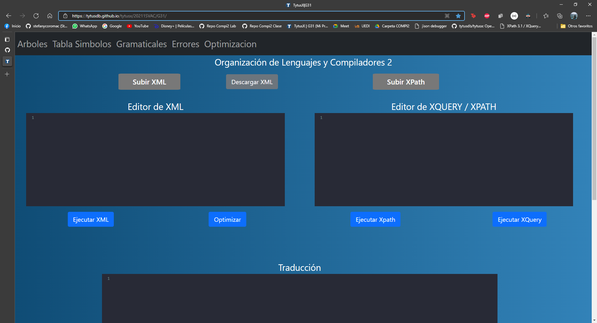
    <p align="center">Editores de XML, Xpath, XQuery y manejo de Optimizacion de codigo de 3D </p>
</div>

Podemos observar en la barra de navegación un conjunto de pestañas para poder visualizar los reportes de cada uno de los analizadores de XML, XPath, XQuery y Optimización

<div align="center">
    
    <p align="center">Reportes </p>
</div>

En la parte inferior tenemos el espacio asignado para la generación de código intermedio asi como el area de consola. 

<div align="center">
    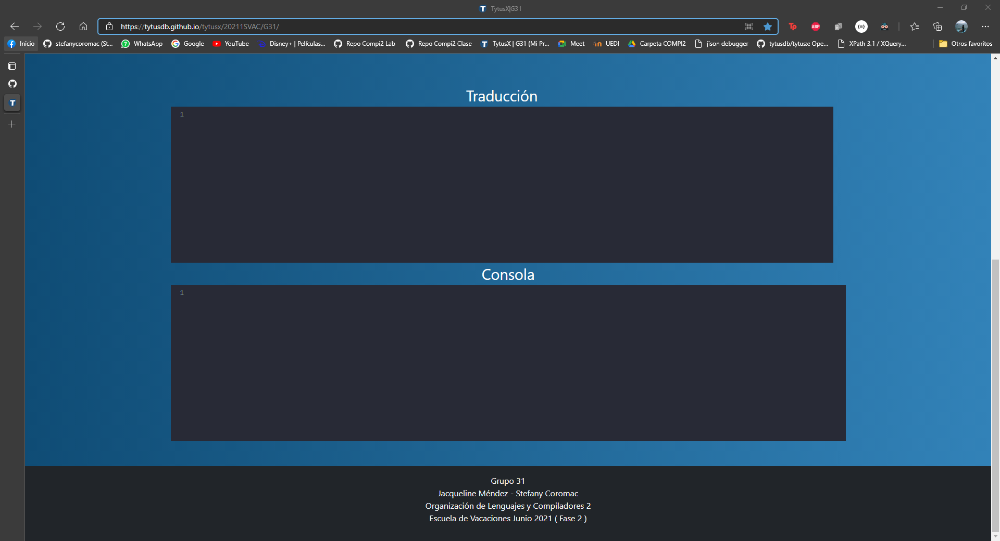
    <p align="center"> Traducción - Consola</p>
</div>

## **Uso de la aplicación** <a name="idUsoApp2"></a>

#### Ejemplo de entrada de XML

1. El archivo del cual se realizan las consultas tanto de Xpath y XQuery 
es de XML por lo tanto este primero debe ser leido por la herramienta. 

```bash 
<?xml version="1.0" encoding="ISO-8859-1"?>
<catalog>
   <book id="bk101">
      <author>Gámbardellä, Mátthew</author>
      <title>XML Developer&apos;s Guide</title>
      <genre>Computer</genre>
      <price>44.95</price>
      <publish_date>2000-10-01</publish_date>
      <description>An in-depth look at creating applications 
      with XML.</description>
   </book>
   <book id="bk102">
      <author>Ralls, Kim</author>
      <title>Midnight Rain</title>
      <genre>Fantasy</genre>
      <price>5.95</price>
      <publish_date>2000-12-16</publish_date>
      <description>A former architect battles corporate zombies, 
      an evil sorceress, and her own childhood to become queen 
      of the world.</description>
   </book>
   <book id="bk112">
      <author>Galos, Mike</author>
      <title>Visual Studio 7: A Comprehensive Guide</title>
      <genre>Computer</genre>
      <price>49.95</price>
      <publish_date cali="hola">2001-04-16</publish_date>
      <description>Microsoft Visual Studio 7 is explored in depth,
      looking at how Visual Basic, Visual C++, C#, and ASP+ are 
      integrated into a comprehensive development 
      environment.</description>
   </book>
</catalog>

```

2. Seguidamente se genera el codigo de tres direcciones del archivo de XML. 

<div align="center">
    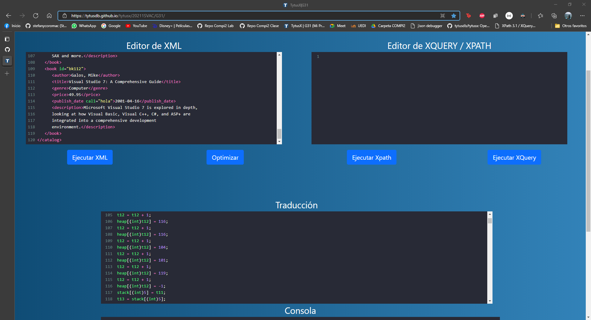
    <p align="center"> Ejecución de XML </p>
</div>

#### Ejemplo de entrada de XPATH

```bash 
/bookstore/book/title
/bookstore/book[1]/title
/bookstore/book/price[text()]
/bookstore/book[price>35]/price
```

3. Se ejecuta la consulta en XPATH y se genera el código de 3D. 


<div align="center">
    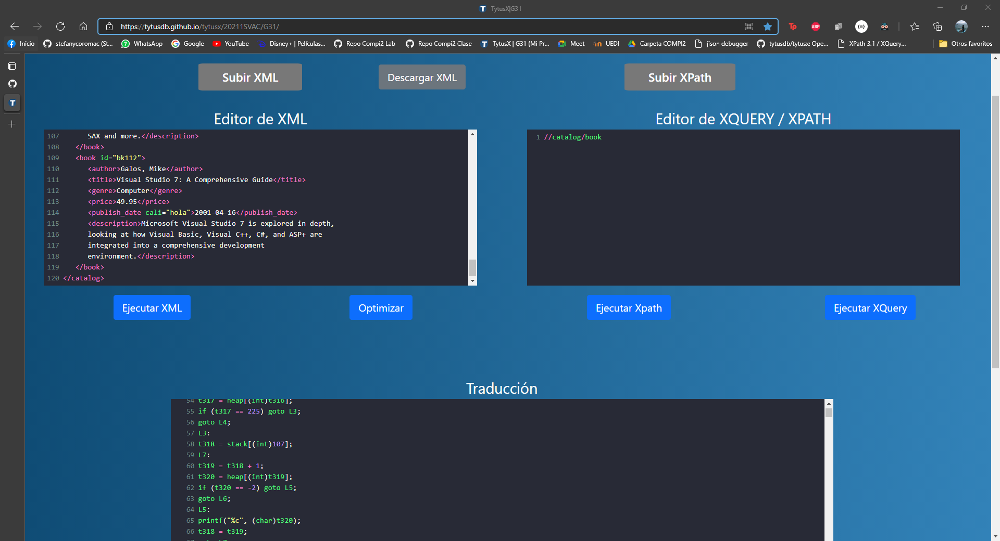
    <p align="center"> Ejecución de XPATH</p>
</div>

#### Ejemplo de entrada de XQUERY

```bash 

declare function local:fibonacci($n as xs:integer) as xs: integer 
{
   if($n > 1) then local:fibonacci($n - 1) +   local:fibonacci($n-2)
   else if ($n = 1) then 1 
   else if ($n = 0) then 0 
   else -1 

}, 

local:fibonacci(10) 

```

4. Luego podemos ejecutar funciones y consultas con XQUERY 


<div align="center">
    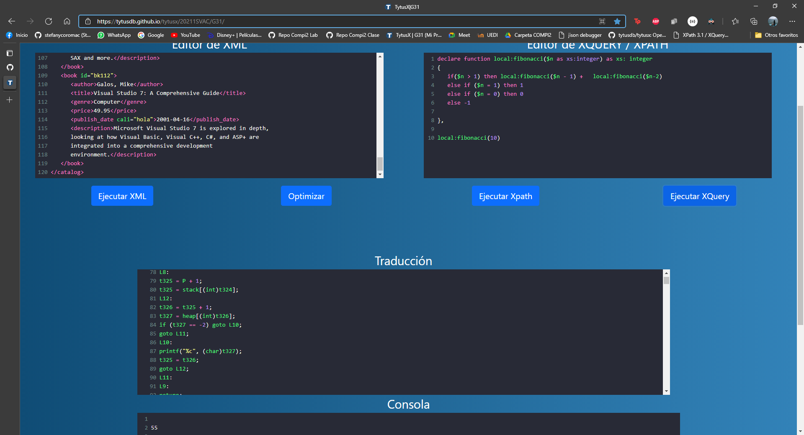
    <p align="center"> Ejecución de XQuery </p>
</div>


### Reportes Fase 2 

- [Tabla de Simbolos XQuery y XML](#idTablasS)
- [Arbol CST de XQuery](#idArbol)
- [Reporte de Optimizaión](#idOptimizacion)
- [Reporte de Errores](#idErrores2)

## Tabla de Simbolos de XQuery y XML  <a name="idTablaS"></a>

<div align="center">
    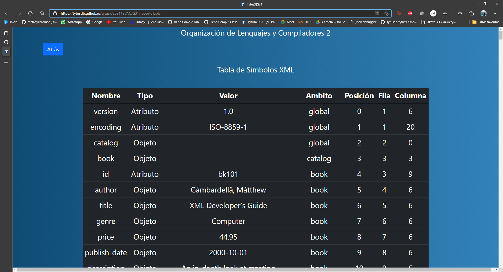
    <p align="center"> Tabla de Simbolos de XML </p>
</div>

<div align="center">
    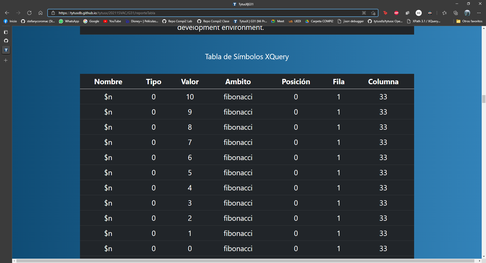
    <p align="center"> Tabla de Simbolos de XQuery </p>
</div>


## Árbol CST DE XQUERY  <a name="idArbol"></a>

<div align="center">
    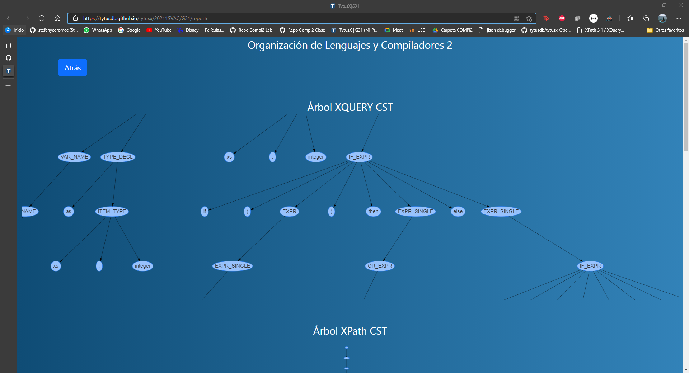
    <p align="center"> Árbol CST XQuery </p>
</div>

## Reporte de Optimización <a name="idOptimizacion"></a>

<div align="center">
    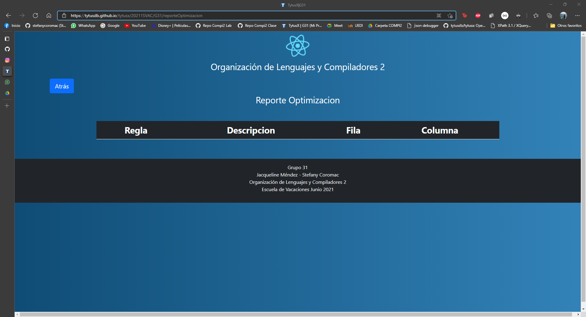
    <p align="center"> Reporte de Optimización </p>
</div>


## Reporte de Errores <a name="idErrores2"></a>

<div align="center">
    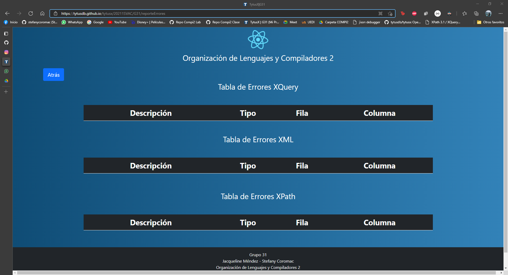
    <p align="center"> Reporte de Errores </p>
</div>
