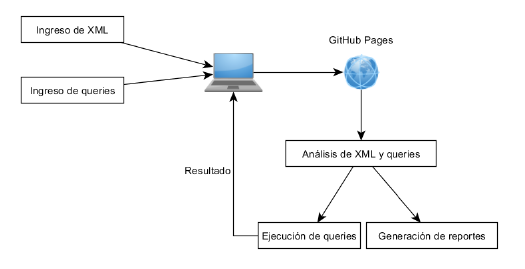

Universidad de San Carlos de Guatemala  
Facultad de Ingeniería  
Escuela de Ciencias y Sistemas  
Organización de Lenguajes y Compiladores 2        
Sección A
_____

# **Manual Técnico**

_____

**Contenido**   
1. [Introduccion](#id1)
2. [Objetivo del manual](#id2)
3. [Estructura General](#id3)
4. [Xpath 3.1 y Xml 3.1](#id4)

## **Introducción**
***
En el siguiente escrito se tiene la finalidad de proporcionar al usuario la lógica empleada tras el software "TytusX" y bajo la cual se desarrolló. También se incluyen otros detalles técnicos como el lenguaje donde se desarrolló, los pasos empleados en la construcción, descripción de la implementación de los lenguajes aceptados, entre otros conceptos.

TytusX es un administrador de bases de datos diseñado para almacenar datos que se encuentre en archivos ".XML". Para obtenerla se hace uso de consultas bajo la sintaxis del lenguaje "XPath".

Para la gestión de la información con TytusX deberá de introducirse por medio de la consola de inicio. Esta debe de seguir las reglas léxicas y sintácticas propias del lenguaje ".XML" para evitar inconvenientes al momento de realizar la carga. Una vez se posee la información se podrá acceder a ella por medio de consultas que estarán bajo los lineamientos del lenguaje "XPath" utilizando la consola de consultas. La información resultante se mostrará en la consola de igual forma.

## **Objetivo del manual**
***
El manual técnico pretende dar a conocer las herramientas y la manera en que se utilizaron para programar la siguiente aplicación, además de la lógica empleada para el desarrollo de los analizadores implementados para la solución. Se presentará una sección donde se explicarán los requerimientos necesarios, los lineamientos bajo los que se realizaron los analizadores y el funcionamiento general. Se complementará la explicación colocando parte de la codificación empleada así como las gramáticas para una mejor explicación. Para conocer la guía de la correcta utilización del programa se debe de consultar el ["Manual de Usuario de TytusX"](./Manual%20de%20Usuario.md).

## **Estructura General**
***

### Flujo de la Fase 1 

  

### Framework Utilizado 
 **Quasar**: Quasar es un framework basado en VueJS que permite a los desarrolladores web crear de forma rápida sitios web responsives y aplicaciones.

 Para más información consultar el sitio oficial
 https://quasar.dev/

 **Lenguaje** : Para realizar la funcionalidad del analizador se utilizo typescript y javascript para generar toda la ejecucion del interprete

 **Gráfica**: Las graficas se realizaron con la libreria viz.js

## **Xpath 3.1 y Xml 3.1**
***

Para entender la sintaxis de XML se puede revisar el sitio: https://www.w3schools.com/xml/

Gramatica Utilizada 

Se puede verificar en la carpeta de este repositorio llamada Gramaticas-BNF 

https://github.com/tytusdb/tytusx/tree/main/20211SVAC/G32/Gramaticas-BNF

o directamente de la gramatica en el archivo .jison adjuntas en este repositorio 

https://github.com/tytusdb/tytusx/tree/main/20211SVAC/G32/analizador/gramaticas

La sintaxis de XPath se puede verificar en la siguiente dirección: https://www.w3schools.com/xml/xpath_intro.asp