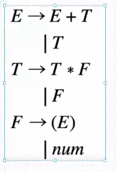
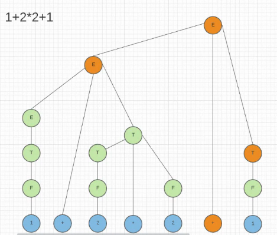
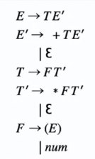

UNIVERSIDAD SAN CARLOS DE GUATEMALA

FACULTAD DE INGENIERÍA

ESCUELA DE CIENCIAS Y SISTEMAS

MANUAL TÉCNICO
==============

TYTUSX

ORGANIZACIÓN DE LENGUAJES Y COMPILADORES 2

GRUPO 35

Carnet

Nombre

201612419

Edvin Miguel Castro Ajaitas

201611269

Carlos Augusto Hernández Ordoñez

201612190

Marcos Sebastian Velasquez Cabrera

INTRODUCCIÓN

El proyecto de tytusx nace de la necesidad de tener un intérprete tanto de información base de un archivo xml y finalmente un intérprete de consulta con lenguaje xpath para poder leer la información que se tiene ya que se puede tener amba información en la misma aplicación sin necesidad de recurrir a nuevas herramientas que por lo general trabajan por sí solas. La integración de estas herramientas facilita el manejo de todo

ANTECEDENTES
============

Ambos intérpretes tienen la particularidad de poder generar un árbol sintáctico tanto ascendentemente como descendente. De esta forma puede hacerse una comprobación de información importante sin importar de la forma que ayuda tanto a la traducción a código de tres direcciones.

Secuencia del proceso
=====================

nuestro intérprete tiene la particularidad de hacer la interpretación al mismo tiempo tanto de la información en formato XML y XPATH de esta forma el proceso trabaja de forma paralela.

GRAMÁTICAS

Al ser una herramienta con diferentes usos, existe la posibilidad de hacer uso de tanto un traductor ascendente, como descendente.

La única diferencia particularmente es la recursividad. Ya que se sabe que un analizador descendente no puede ser recursivo por la izquierda

ASCENDENTE
----------

Cuando tenemos una gramática ascendente podemos tener la particularidad del siguiente comportamiento

árbol asociado a esta entrada.

De tal forma como podemos ver, este árbol que se crea al momento de evaluar por medio de las producciones, que este árbol en particular debemos utilizarlo y analizarlo como lo debemos hacer. Más adelante se explicará cómo hacerlo.

podemos destacar diferentes tipos de árboles que podemos encontrar

ambigüedad

Provoca un error tipo shift/reduce

Cup trabaja con LALR

a+b\*c

DESCENDENTE
-----------

Gramática de tipo LL, es de tipo descendente

a+b\*c

el tipo de LL1 es el símbolo de anticipación

Patrones de diseño

Un patrón de diseño es una forma reutilizable de resolver un problema común.

Debemos destacar las siguientes características:

*   Es una forma reutilizable de resolver un problema común.  
    
*   Ahorran tiempo de programación.  
    
*   Permiten solucionar la mayor parte de tus problemas de forma directa y ayudan a estar seguro de la validez del código.  
    
*   Ayudan a estar seguro de la validez del código.  
    
*   Los patrones de diseño establecen un lenguaje común entre todo los miembros del equipo.

ahora hablemos más específicamente sobre el patrón intérprete.

Patrón Intérprete
=================

Es un patrón de diseño que, dado un lenguaje, define una representación para su gramática junto con un intérprete del lenguaje.

Se usa para definir un lenguaje para representar expresiones regulares que representen cadenas a buscar dentro de otras cadenas. Además, en general, para definir un lenguaje que permita representar las distintas instancias de una familia de problemas.

Específicamente nuestro software necesita un lugar donde guardar la información relevante y cuyo caso consultar, o modificar más adelante para ello necesitamos de una estructura que se adecue a nuestras necesidades. Para ello la llamaremos como una tabla de símbolos, pero que dependiendo el caso necesario, no debe ser una tabla, sino una estructura que sea óptima para nuestras tareas.

Tabla de símbolos.
==================

Es la que permite el almacenamiento y recuperación de los valores de las etiquetas. Para su implementación hacemos uso de una clase, ya que necesitaremos más de una instancia de tabla de símbolos. Cada ámbito tiene acceso únicamente a su propia tabla de símbolos y a la de los niveles superiores.

También en nuestro uso de software debemos destacar algunas particularidades, una de ellas es:

Gramática ascendente XML
========================

En la siguiente tabla mostramos la información de como se desarrolla nuestra gramática de forma general explicando más detalladamente las particularidades de esta.

Debemos destacar la producción INSTRUCCIONES e ATRIBUTOS que se comportan de la siguiente manera

A → A B

 | B

Gramática ascendente XML
========================

Por lo que podemos deducir que son recursivas por la izquierda.

En cambio si miramos el reporte de la gramática xml DESCENDENTE

Notamos nuevamente el siguiente comportamiento tanto en la producción INSTRUCCIONES como ATRIBUTOS

A → B A

 | B

 | ε 

Ahora tiene una recursividad por la derecha y tiene una producción a ε que es un pivote que ayuda al analizador a subir o sintetizar la información que antes tenía cuando sube todo.

Gramática ascendente XPATH
==========================

En este apartado tenemos 5 producciones

INSTRUCCIONES

RESERVADAS

 EXPRESIONES

VALOR INICIAL

VALOR

INSTRUCCIONES
-------------

INSTRUCCIONES : INSTRUCCIONES '/' '/' INSTRUCCION

 |INSTRUCCIONES '/' INSTRUCCION {}

 |INSTRUCCIONES ':' ':' INSTRUCCION { }

 |INSTRUCCIONES INSTRUCCION {}

 |'/' '/' INSTRUCCION {}

 |'/' INSTRUCCION {}

 |':' ':' INSTRUCCION { }

 |INSTRUCCION { }

 ;

RESERVADAS
----------

RESERVADAS\_XPATH: rAncestor {}

| rAncestorOrSelf {}

|rAttribute{}

|rChild {}

|rDescendant {}

|rDescendantOrSelf {}

|rFollowing {}

|rFollowingSibling{}

|rNamespace {}

|rParent {}

|rPreceding{}

|rPrecedingSibling{}

|rSelf {}

;

EXPRESIONES
-----------

E: E '+' E {}

 |E '-' E {}

 |E '\*' E {}

 |E rDiv E {}

 |'-' E {}

 |parentesisIzquierdo E parentesisDerecho {}

 |E rAnd E { }

 |E rOr E { }

 |E mod E {}

 |E menorIgualQue E { }

 |E mayorIgualQue E { }

 |E menorQue E { }

 |E mayorQue E { }

 |E '=' E { }

 |E diferenteQue E {}

 |VALOR\_INI {}

 ;

VALOR / VALOR INICIAL
---------------------

VALOR\_INI :   VALOR\_INI '/' '/' VALOR {}

 |VALOR\_INI '/' VALOR {}

 |VALOR\_INI ':' ':' VALOR {}

 |VALOR\_INI VALOR { }

 |'/' '/' VALOR {}

 |'/' VALOR {}

 |':' ':' VALOR {}

 |VALOR  { }

 ;

VALOR: rLast parentesisIzquierdo parentesisDerecho { }

 |rPosition parentesisIzquierdo parentesisDerecho {}

 |rText parentesisIzquierdo parentesisDerecho { }

 |rNode parentesisIzquierdo parentesisDerecho {}

 |id { }

 |entero { }

 |doble { }

 |'@' '\*' {}

 |rStringComillaSimple {}

 |rStringComillaDoble { }

 | '@' id { }

 |punto { }

 | id '\[' E '\]' {}

 |'@' id '\[' E '\]' {}

;

Errores
=======

Entre los errores que ya conocemos podemos destacar 3

1.  Errores léxicos: aquellos que un símbolo no pertenece al lenguaje.
2.  Sintáctico, el orden de los tokens no es el correcto
3.  Y finalmente el Semántico que sigan ciertas reglas algunas producciones.

1.  En el caso de etiquetas solamente existe un error semántico sin la etiqueta que abre no es la misma a la que cierra.  
    

  

En este último debemos destacar que podemos encontrar múltiples errores, a lo largo de la programación, por lo que debemos destacar algunos casos

CONCLUSIÓN

Un sistema como tytusx puede ser utilizado con muchos beneficios, tales como no tener una base de datos, sino información en formato xml que pueda ser leído y traducido de forma rápida y eficaz que todo se maneje desde una herramienta con la posibilidad de usarse de forma nativa con la lectura de información a través de un servidor. Puede ser muy efectiva a largo plazo. puesto que el lenguaje xpath actualmente tiene una versión 3.1 que no se ha actualizado desde 2014. Al día de hoy 2021 existen muchas herramientas que tampoco llevan esta versión actualizada. por lo que es una opción promover uso actualizado de estos lenguajes.