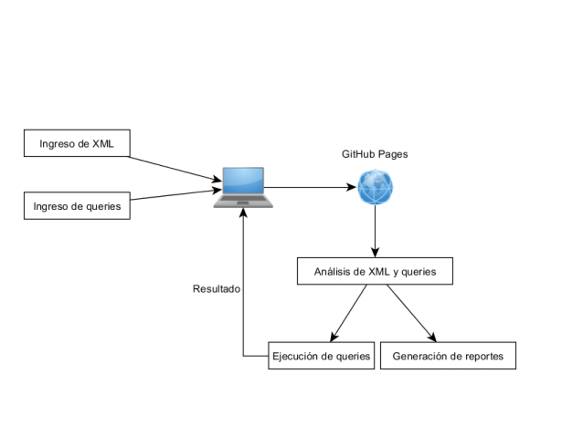

# **Manual Técnico**

# Manual de Usuario

***

### Explicación de la aplicación

TytusX es un administrador de bases de datos documental de código abierto 
desarrollado bajo licencia MIT que utilizará lenguaje JavaScript para su 
construcción. Soportará archivos XML y manejará los lenguajes de consultas XPath
y XQuery.

### Lenguajes y Herramientas
Lenguaje / Herramienta | Funcion
------------ | ------------- 
TypeScript | Lenguaje base sobre el que esta desarrollado el proyecto.
JavaScript | Codigo transpilado para su ejecucion en navegadores como scripts.
Html | Lenguaje para el desarrollo del frontend de la aplicacion.
CSS | Lenguaje para los estilos de la aplicacion web.
Jison | Herramienta para la creacion de los analizadores lexicos y sintacticos de los lenguajes fuente (XML, XPath, XQuery). utiliza gramaticas libres del contexto que serviran para el analisis de las entradas del usuario. 
Vis js | Libreria utilizada para la creacion de reportes. 
Jquery 1.7.2 | Manipulacion de elementos html del frontend de la aplicacion.
CodeMirror | Libreria para estilizar los bloques de texto editable por el usuario, que reconocen los lenguajes fuente.

### Flujo de la aplicacion

### Analisis lexico y sintactico
##### XML

El analisis lexico fue realizado con la herramienta de analisis sintactico Jison, se definieron expresiones regulares para el analisis lexico y se utilizo una gramatica ascendente.

Para la ocnstruccion del arbol de analisis sintactico se utilizo el patron interpreter, se creo una clase abstracta para poder heredar de ella las difetentes expresiones y funciones que podemos encontrar. Se crea entonces una lista de instrucciones y estas se analizan para formar el arbol asi como la traduccion. Para esto cada una de las clases sobrescriben sus respectivos metodos traducir y obtenerArbol con los que genera la salida deseada segun sea la instruccion. Los metodos son llamados desde el padre que ejecuta el metodo de sus hijos creando asi un arbol logico.
Para la recuperacion de errores se generaron estados de error que se recuperaban con el simbolo >
