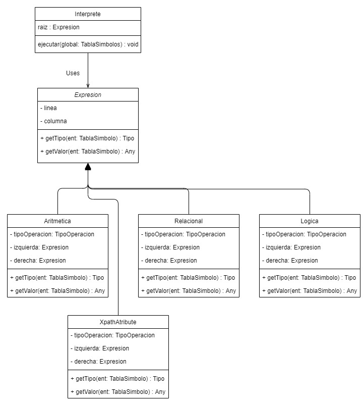
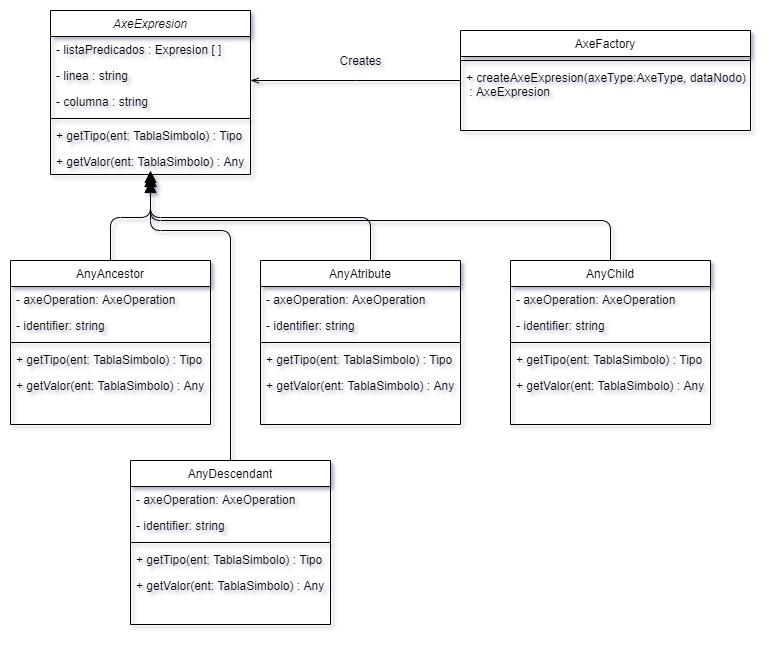

# *Lenguajes y Compiladores 2*

# **Manual Tecnico TytusX**
# **Grupo 38**

# **I. Tecnolgias Utilizadas**

<ol>
<li>HTML</li>
<li>JAVASCRIPT</li>
<li>TYPESCRIPT</li>
<li>GITHUB / GITHUB PAGES</li>
<li>Entorno de desarrollo WEBSTORM</li>
</ol>

## **II. Arquitectura de la Aplicación**

 Para realizar la solución se creo todo del lado del frontend,
debido a la limitante de poder desplegar en GHP y que esta no debia consumir
servicios de otro servidor backend.

 La solución cuenta con dos analizadores realizados con la herramienta
JISON, estos devuelven como salida dos arboles de analisis de sintaxis una para
XML y otro para XPATH respectivamente.

 Como primer paso procesamos el arbol XML para genera la Tabla de Simbolos 
que va a consumir el motor de ejecucion de consultas XPATH.

 El motor de consultas es realizado implementando funcionalidad 
en el AST de XPATH la cual ejecuta cada accion utilizando como insumo la tabla
de simbolos previamente llenada y generando las respectivas salidas o 
reportes de errores en caso de encontrar alguno.

## **III. Patrones de diseño**

 A continuación una pequeña descripcion de los patrones utilizados 
para la ejecucion del lenguaje XPATH 

<ol>
<li>Patron Singleton: Esta patron se utilizo para la parte de reportes de errores y reportes gramaticales.
Nos facilita para poder llenar estos reportes desde cualquier punto de la aplicación,
sin estar pendiente de obtener la instancia de estos reportes por medio de algun parametro o constructor.</li>

<li>Patron Factory: Este patron se utilizo para generar diferentes instancias para las clases
AXE-EXPRESIONS en el cual se decidia utilizar diferente clase en base a un enum generado en el analisis,
el cual me indicaba la instancia necesaria</li>

<li>Patron Interprete: Sirvio para dar un comportamiento general a todas las clases
expresion.</li>

<li>Patron Estrategia: Este patron se utilizo en toda el arbol XPATH para
darle distinto comportamiento a cada clase que implementaba la clase EXPRESION</li>

</ol>

## **IV. Diagramas de Clases**

En este diagrama podemos ver el patron utilizado para construir las expresion
en el AST del lenguaje XPATH en el cual cada clase debia implementar los 
metodos getValor(ts):any y getTipo(ts):Tipo de la interfaz Expresion dandole
un comportamiento diferente utilizando el patron Interprete y Estrategia.

En el siguiente diagrama observamos la implementacion de el patron factory
para la creacion de los nodos de tipo AxeExpresion, estos nodos se crearon por 
medio de un enum AxeType el cual le decia a la clase AxeFactory que tipo de objeto
debia generar, haciendo mas sencillo la creacion de los mismo y abstrayendo el 
detalle en la clase cliente.

## **V. Gramaticas**

## **Gramatica XML BNF**

### Lexico
<table>
<tr><td>\s+               </td><td>        /* ignorar espacios en blanco */</td></tr> 
<tr><td>"<!--"[^'-']*"-->"	</td><td>	  /* ignorar comentario*/</td></tr>
<tr><td>"<"					</td><td>		'menor'</td></tr>
<tr><td>">"					</td><td>		'mayor'</td></tr>
<tr><td>"="             </td><td>      	    'igual'</td></tr>
<tr><td>"/"              </td><td>     	    'slash'</td></tr>
<tr><td>"“"[^\"\n]*"”" 		</td><td>		'str'</td></tr>
<tr><td>[0-9]+("."[0-9]+)?\b  	</td><td>	'num'</td></tr>
<tr><td>[a-zA-Z]([a-zA-Z0-9]|"_"|"-")*	</td><td>'id'</td></tr>
<tr><td>"\\="|"\\<"|"\\>"|"\\/"|"\\“"|"\\\""|"\\'"|"\\’"|"\\`"|"\\`"|"\\‘"|. </td><td> 'signo_especial'</td></tr>
<tr><td>"&lt;"|"&gt;"|"&amp;"|"&apos;"|"&quot;"             </td><td>           'caracter_especial'</td></tr>
<tr><td>[^a-zA-Z/<>=]                             </td><td>                            'signo'</td></tr>
</table>

### Sintactico

<table>
<tr><td> &lt;LISTA_TAGS&gt;  ::= &lt;LISTA_TAGS&gt;  &lt;TAG&gt;  | &lt;LISTA_TAGS&gt; &lt;error&gt;  </td></tr>
<tr><td> &nbsp;&nbsp;&nbsp;&nbsp;&nbsp;&nbsp;&nbsp;&nbsp;     | &lt;TAG&gt;  | &lt;error&gt; </td></tr>
<tr><td></td></tr>
<tr><td>&lt;TAG&gt; ::=  &lt;TAG_APERTURA&gt; mayor &lt;TAG_CIERRE>" </td></tr>
<tr><td>&nbsp;&nbsp;&nbsp;&nbsp;&nbsp;&nbsp;&nbsp;&nbsp;  |&lt;TAG_APERTURA&gt; slash mayor </td></tr>
<tr><td>&nbsp;&nbsp;&nbsp;&nbsp;&nbsp;&nbsp;&nbsp;&nbsp;  |&lt;TAG_APERTURA&gt; mayor &lt;LISTA_TAGS&gt; &lt;TAG_CIERRE&gt; </td></tr>
<tr><td>&nbsp;&nbsp;&nbsp;&nbsp;&nbsp;&nbsp;&nbsp;&nbsp;  |&lt;TAG_APERTURA&gt; mayor &lt;CONTENIDO>  &lt;TAG_CIERRE&gt; </td></tr>
<tr><td>&nbsp;&nbsp;&nbsp;&nbsp;&nbsp;&nbsp;&nbsp;&nbsp;  |error mayor</td></tr>
<tr><td></td></tr>
<tr><td>&lt;TAG_APERTURA&gt;  ::=  &lt;TAG_APERTURA&gt; id igual str </td></tr>
<tr><td>&nbsp;&nbsp;&nbsp;&nbsp;&nbsp;&nbsp;&nbsp;&nbsp;| menor id </td></tr>
<tr><td></td></tr>
<tr><td>&lt;TAG_CIERRE&gt;    ::= menor slash id mayor</td></tr>
<tr><td></td></tr>
<tr><td>&lt;CONTENIDO&gt;     ::=  &lt;CONTENIDO&gt;  &lt;VALOR&gt;</td></tr>
<tr><td>&nbsp;&nbsp;&nbsp;&nbsp;&nbsp;&nbsp;&nbsp;&nbsp;| &lt;VALOR&gt;</td></tr>
<tr><td></td></tr>
<tr><td>&lt;VALOR&gt;        ::= id</td></tr>
<tr><td>&nbsp;&nbsp;&nbsp;&nbsp;&nbsp;&nbsp;&nbsp;&nbsp;| str</td></tr>
<tr><td>&nbsp;&nbsp;&nbsp;&nbsp;&nbsp;&nbsp;&nbsp;&nbsp;| signo_especial</td></tr>
<tr><td>&nbsp;&nbsp;&nbsp;&nbsp;&nbsp;&nbsp;&nbsp;&nbsp;| caracter_especial</td></tr>
<tr><td>&nbsp;&nbsp;&nbsp;&nbsp;&nbsp;&nbsp;&nbsp;&nbsp;| signo</td></tr>
<tr><td>&nbsp;&nbsp;&nbsp;&nbsp;&nbsp;&nbsp;&nbsp;&nbsp;| num</td></tr>
</table>

## **Gramatica XPATH BNF**

## Lexico

<table>
<tr><td>\s+                  </td><td>               /* skip whitespace */</td></tr>
<tr><td>'node'               </td><td>         'node';</td></tr>
<tr><td>'last'               </td><td>         'last';</td></tr>
<tr><td>'position'           </td><td>         'position';</td></tr>
<tr><td>'text'               </td><td>         'text';</td></tr>
<tr><td>'ancestor-or-self'   </td><td>         'ancestor-or-self';</td></tr>
<tr><td>'ancestor'           </td><td>         'ancestor';</td></tr>
<tr><td>'attribute'          </td><td>         'attribute';</td></tr>
<tr><td>'child'              </td><td>         'child';</td></tr>
<tr><td>'descendant-or-self' </td><td>         'descendant-or-self';</td></tr>
<tr><td>'descendant'         </td><td>         'descendant';</td></tr>
<tr><td>'following-sibling'  </td><td>         'following-sibling';</td></tr>
<tr><td>'following'          </td><td>         'following';</td></tr>
<tr><td>'namespace'          </td><td>         'namespace';</td></tr>
<tr><td>'preceding-sibling'  </td><td>         'preceding-sibling';</td></tr>
<tr><td>'parent'             </td><td>         'parent';</td></tr>
<tr><td>'preceding'          </td><td>         'preceding';</td></tr>
<tr><td>'self'               </td><td>         'self';</td></tr>
<tr><td>"::"                 </td><td>         'axe_connector';</td></tr>
<tr><td>"//"                 </td><td>         'any_expresion';</td></tr>
<tr><td>"/"                  </td><td>         'root_expresion';</td></tr>
<tr><td>".."                 </td><td>         'parent_expresion';</td></tr>
<tr><td>"."                  </td><td>         'current_expresion';</td></tr>
<tr><td>"@"                  </td><td>         'atribute_expresion';</td></tr>
<tr><td>"+"                  </td><td>         'plus';</td></tr>
<tr><td>"-"                  </td><td>         'minus';</td></tr>
<tr><td>"*"                  </td><td>         'times';</td></tr>
<tr><td>"div"                </td><td>         'div';</td></tr>
<tr><td>"mod"                </td><td>         'mod';</td></tr>
<tr><td>"<="                 </td><td>         'lte';</td></tr>
<tr><td>">="                 </td><td>         'gte';</td></tr>
<tr><td>"<"                  </td><td>         'lt';</td></tr>
<tr><td>">"                  </td><td>         'gt';</td></tr>
<tr><td>"!="                 </td><td>         'nequal';</td></tr>
<tr><td>"="                  </td><td>        'equal';</td></tr>
<tr><td>"and"                </td><td>         'and';</td></tr>
<tr><td>"or"                 </td><td>         'or';</td></tr>
<tr><td>"("                  </td><td>         'lparen';</td></tr>
<tr><td>")"                  </td><td>         'rparen';</td></tr>
<tr><td>"["                  </td><td>         'lcorchetes';</td></tr>
<tr><td>"]"                  </td><td>         'rcorchetes';</td></tr>
<tr><td>"|"                  </td><td>         'node_set';</td></tr>
<tr><td>(([0-9]+"."[0-9]*)|("."[0-9]+))  </td><td>     'DoubleLiteral';</td></tr>
<tr><td>[0-9]+                           </td><td>     'IntegerLiteral';</td></tr>
<tr><td>[a-zA-Z][a-zA-Z0-9_ñÑ]*          </td><td>     'identifier';</td></tr>
<tr><td>"“"[^\"\n]*"”" 				     </td><td>     'StringLiteral';</td></tr>
</table>

## Precedencias 

<table>
<tr><td>%left 'or'</td></tr>
<tr><td>%left 'and'</td></tr>
<tr><td>%left 'lt' 'lte' 'gt' 'gte' 'equal' 'nequal'</td></tr>
<tr><td>%left 'plus' 'minus'</td></tr>
<tr><td>%left 'times' 'div' 'mod'</td></tr>
<tr><td>%left 'lparen' 'rparen'</td></tr>
</table>

## Sintactico

<table>
<tr><td>START : LISTA-XPATH EOF </td></tr>
<tr><td>----------------------------------------------------------------------------------------------</td></tr>
<tr><td>LISTA-XPATH: LISTA-XPATH node_set XPATH-EXPRESION</td></tr>
<tr><td>           | XPATH-EXPRESION</td></tr>
<tr><td>----------------------------------------------------------------------------------------------</td></tr>
<tr><td>XPATH-EXPRESION : XPATH-EXPRESION EXPRESION </td></tr>
<tr><td>                | EXPRESION  </td></tr>
<tr><td>                | FIRST_EXPRESION</td></tr>
<tr><td>----------------------------------------------------------------------------------------------</td></tr>
<tr><td>FIRST_EXPRESION : identifier</td></tr>
<tr><td>                  | times</td></tr>
<tr><td>                  | node lparen rparen </td></tr>
<tr><td>                  | current_expresion</td></tr>
<tr><td>                  | atribute_expresion identifier </td></tr>
<tr><td>                  | atribute_expresion times </td></tr>
<tr><td>                  | atribute_expresion node lparen rparen</td></tr>
<tr><td>                  | atribute_expresion identifier LISTA_PREDICATES </td></tr>
<tr><td>				  | atribute_expresion times LISTA_PREDICATES </td></tr>
<tr><td>                  | atribute_expresion node lparen rparen LISTA_PREDICATES </td></tr>
<tr><td>                  | identifier LISTA_PREDICATES </td></tr>
<tr><td>                  | node lparen rparen LISTA_PREDICATES </td></tr>
<tr><td>                  | times LISTA_PREDICATES </td></tr>
<tr><td>                  | AXES_NAME axe_connector identifier </td></tr>
<tr><td>                  | AXES_NAME axe_connector times </td></tr>
<tr><td>                  | AXES_NAME axe_connector node lparen rparen </td></tr>
<tr><td>                  | AXES_NAME axe_connector text lparen rparen </td></tr>
<tr><td>                  | AXES_NAME axe_connector identifier LISTA_PREDICATES </td></tr>
<tr><td>                  | AXES_NAME axe_connector times LISTA_PREDICATES </td></tr>
<tr><td>                  | AXES_NAME axe_connector node lparen rparen LISTA_PREDICATES </td></tr>
<tr><td>                  | AXES_NAME axe_connector text lparen rparen LISTA_PREDICATES </td></tr>
<tr><td>----------------------------------------------------------------------------------------------</td></tr>
<tr><td>EXPRESION : root_expresion identifier </td></tr>
<tr><td>          | root_expresion atribute_expresion identifier </td></tr>
<tr><td>          | root_expresion atribute_expresion times </td></tr>
<tr><td>          | root_expresion atribute_expresion node lparen rparen </td></tr>
<tr><td>          | root_expresion current_expresion </td></tr>
<tr><td>          | root_expresion parent_expresion </td></tr>
<tr><td>          | root_expresion times </td></tr>
<tr><td>          | root_expresion node lparen rparen </td></tr>
<tr><td>          | root_expresion AXES_NAME axe_connector identifier </td></tr>
<tr><td>          | root_expresion AXES_NAME axe_connector times </td></tr>
<tr><td>          | root_expresion AXES_NAME axe_connector node lparen rparen </td></tr>
<tr><td>          | root_expresion AXES_NAME axe_connector text lparen rparen </td></tr>
<tr><td>          | root_expresion text lparen rparen </td></tr>
<tr><td>          | any_expresion identifier </td></tr>
<tr><td>          | any_expresion atribute_expresion identifier </td></tr>
<tr><td>          | any_expresion atribute_expresion times </td></tr>
<tr><td>          | any_expresion atribute_expresion node lparen rparen </td></tr>
<tr><td>          | any_expresion current_expresion </td></tr>
<tr><td>          | any_expresion parent_expresion </td></tr>
<tr><td>          | any_expresion times </td></tr>
<tr><td>          | any_expresion node lparen rparen </td></tr>
<tr><td>          | any_expresion AXES_NAME axe_connector identifier </td></tr>
<tr><td>          | any_expresion AXES_NAME axe_connector times </td></tr>
<tr><td>          | any_expresion AXES_NAME axe_connector node lparen rparen </td></tr>
<tr><td>          | any_expresion AXES_NAME axe_connector text lparen rparen </td></tr>
<tr><td>          | any_expresion text lparen rparen </td></tr>
<tr><td>          | root_expresion identifier LISTA_PREDICATES </td></tr>
<tr><td>          | root_expresion atribute_expresion identifier LISTA_PREDICATES </td></tr>
<tr><td>          | root_expresion atribute_expresion times LISTA_PREDICATES </td></tr>
<tr><td>          | root_expresion atribute_expresion node lparen rparen LISTA_PREDICATES </td></tr>
<tr><td>          | root_expresion current_expresion LISTA_PREDICATES </td></tr>
<tr><td>          | root_expresion parent_expresion LISTA_PREDICATES </td></tr>
<tr><td>          | root_expresion times LISTA_PREDICATES </td></tr>
<tr><td>          | root_expresion node lparen rparen LISTA_PREDICATES </td></tr>
<tr><td>          | root_expresion AXES_NAME axe_connector identifier LISTA_PREDICATES </td></tr>
<tr><td>          | root_expresion AXES_NAME axe_connector times LISTA_PREDICATES </td></tr>
<tr><td>          | root_expresion AXES_NAME axe_connector node lparen rparen LISTA_PREDICATES </td></tr>
<tr><td>          | root_expresion AXES_NAME axe_connector text lparen rparen LISTA_PREDICATES </td></tr>
<tr><td>          | root_expresion text lparen rparen LISTA_PREDICATES </td></tr>
<tr><td>          | any_expresion identifier LISTA_PREDICATES </td></tr>
<tr><td>          | any_expresion atribute_expresion identifier LISTA_PREDICATES </td></tr>
<tr><td>          | any_expresion atribute_expresion times LISTA_PREDICATES </td></tr>
<tr><td>          | any_expresion atribute_expresion node lparen rparen LISTA_PREDICATES </td></tr>
<tr><td>          | any_expresion current_expresion LISTA_PREDICATES </td></tr>
<tr><td>          | any_expresion parent_expresion LISTA_PREDICATES </td></tr>
<tr><td>          | any_expresion times LISTA_PREDICATES </td></tr>
<tr><td>          | any_expresion node lparen rparen LISTA_PREDICATES </td></tr>
<tr><td>          | any_expresion AXES_NAME axe_connector identifier LISTA_PREDICATES </td></tr>
<tr><td>          | any_expresion AXES_NAME axe_connector times LISTA_PREDICATES </td></tr>
<tr><td>          | any_expresion AXES_NAME axe_connector node lparen rparen LISTA_PREDICATES </td></tr>
<tr><td>          | any_expresion AXES_NAME axe_connector text lparen rparen LISTA_PREDICATES </td></tr>
<tr><td>          | any_expresion text lparen rparen LISTA_PREDICATES</td></tr>
<tr><td>          |error</td></tr>
<tr><td>----------------------------------------------------------------------------------------------</td></tr>
<tr><td>LISTA_PREDICATES: LISTA_PREDICATES lcorchetes PREDICATE rcorchetes </td></tr>
<tr><td>                | lcorchetes PREDICATE rcorchetes </td></tr>
<tr><td>----------------------------------------------------------------------------------------------</td></tr>
<tr><td>PREDICATE:  EXPRESION_NUMERICA </td></tr>
<tr><td>          | EXPRESION_RELACIONAL </td></tr>
<tr><td>          | EXPRESION_LOGICA </td></tr>
<tr><td>          | PRIMITIVA </td></tr>
<tr><td>          | lparen PREDICATE rparen </td></tr>
<tr><td>----------------------------------------------------------------------------------------------</td></tr>
<tr><td>EXPRESION_LOGICA: PREDICATE or PREDICATE </td></tr>
<tr><td>                | PREDICATE and PREDICATE </td></tr>
<tr><td>----------------------------------------------------------------------------------------------</td></tr>
<tr><td>EXPRESION_RELACIONAL: PREDICATE lt PREDICATE </td></tr>
<tr><td>                    | PREDICATE lte PREDICATE </td></tr>
<tr><td>                    | PREDICATE gt PREDICATE </td></tr>
<tr><td>                    | PREDICATE gte PREDICATE </td></tr>
<tr><td>                    | PREDICATE equal PREDICATE </td></tr>
<tr><td>                    | PREDICATE nequal PREDICATE </td></tr>
<tr><td>----------------------------------------------------------------------------------------------</td></tr>
<tr><td>EXPRESION_NUMERICA: PREDICATE plus PREDICATE </td></tr>
<tr><td>                  | PREDICATE minus PREDICATE </td></tr>
<tr><td>                  | PREDICATE times PREDICATE </td></tr>
<tr><td>                  | PREDICATE div PREDICATE </td></tr>
<tr><td>                  | PREDICATE mod PREDICATE </td></tr>
<tr><td>----------------------------------------------------------------------------------------------</td></tr>
<tr><td>AXES_NAME: ancestor-or-self </td></tr>
<tr><td>          |ancestor </td></tr>
<tr><td>          |attribute </td></tr>
<tr><td>          |child </td></tr>
<tr><td>          |descendant-or-self </td></tr>
<tr><td>          |descendant </td></tr>
<tr><td>          |following-sibling </td></tr>
<tr><td>          |following </td></tr>
<tr><td>          |namespace </td></tr>
<tr><td>          |preceding-sibling </td></tr>
<tr><td>          |preceding </td></tr>
<tr><td>          |parent </td></tr>
<tr><td>          |self </td></tr>
<tr><td>----------------------------------------------------------------------------------------------</td></tr>
<tr><td>FUNCION_NATIVA: last lparen rparen </td></tr>
<tr><td>              | position lparen rparen </td></tr>
<tr><td>----------------------------------------------------------------------------------------------</td></tr>
<tr><td>PRIMITIVA: LISTA-XPATH </td></tr>
<tr><td>         | FUNCION_NATIVA </td></tr>
<tr><td>         | DoubleLiteral </td></tr>
<tr><td>         | IntegerLiteral </td></tr>
<tr><td>         | StringLiteral </td></tr>
</table>