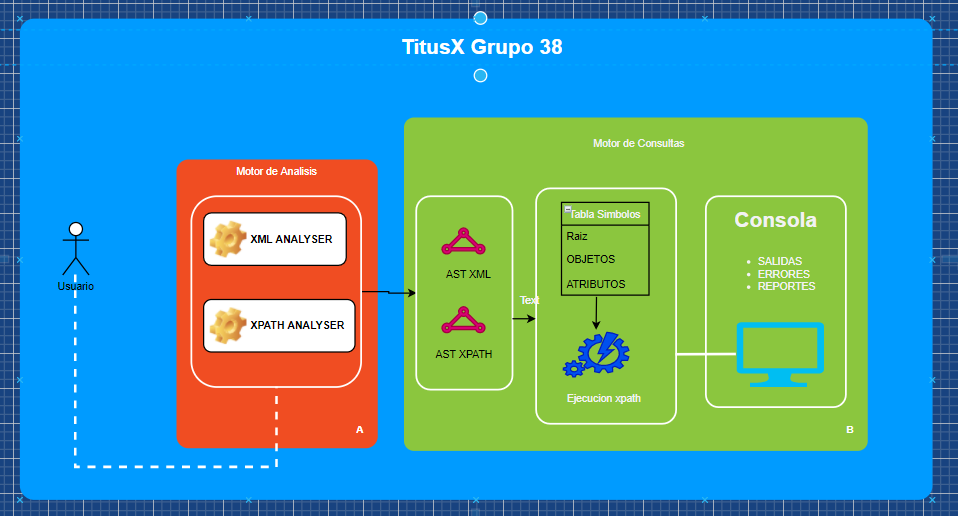
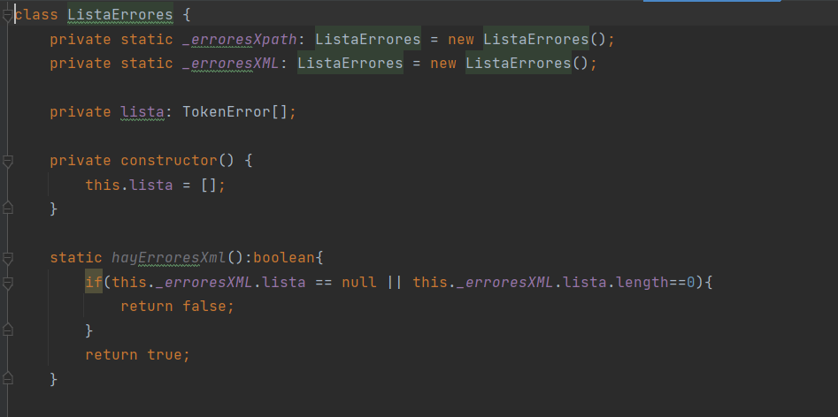
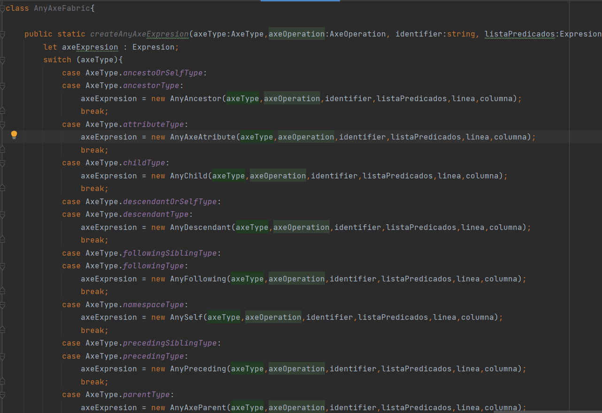
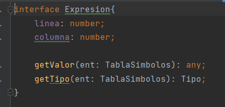
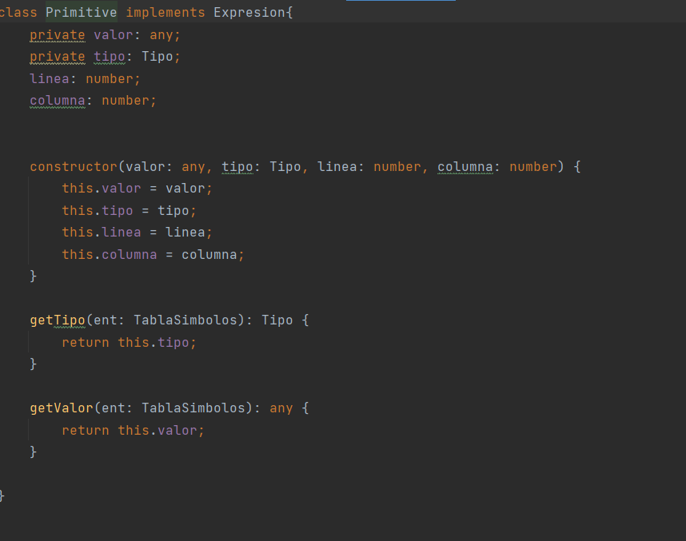

# *Lenguajes y Compiladores 2*

# **Manual Tecnico TytusX**
# **Grupo 38**

# **I. Tecnolgias Utilizadas**

<ol>
<li>HTML</li>
<li>JAVASCRIPT</li>
<li>TYPESCRIPT</li>
<li>GITHUB / GITHUB PAGES</li>
<li>Entorno de desarrollo WEBSTORM</li>
</ol>

## **II. Arquitectura de la Aplicación**

 Para realizar la solución se creo todo del lado del frontend,
debido a la limitante de poder desplegar en GHP y que esta no debia consumir
servicios de otro servidor backend.

 La solución cuenta con dos analizadores realizados con la herramienta
JISON, estos devuelven como salida dos arboles de analisis de sintaxis una para
XML y otro para XPATH respectivamente.

 Como primer paso procesamos el arbol XML para genera la Tabla de Simbolos 
que va a consumir el motor de ejecucion de consultas XPATH.

 El motor de consultas es realizado implementando funcionalidad 
en el AST de XPATH la cual ejecuta cada accion utilizando como insumo la tabla
de simbolos previamente llenada y generando las respectivas salidas o 
reportes de errores en caso de encontrar alguno.

## **III. Patrones de diseño**

 A continuación una pequeña descripcion de los patrones utilizados 
para la ejecucion del lenguaje XPATH 

<ol>
<li>Patron Singleton: Esta patron se utilizo para la parte de reportes de errores y reportes gramaticales.
Nos facilita para poder llenar estos reportes desde cualquier punto de la aplicación,
sin estar pendiente de obtener la instancia de estos reportes por medio de algun parametro o constructor.</li>

<li>Patron Factory: Este patron se utilizo para generar diferentes instancias para las clases
AXE-EXPRESIONS en el cual se decidia utilizar diferente clase en base a un enum generado en el analisis,
el cual me indicaba la instancia necesaria</li>
<li>

<li>Patron Interprete: Sirvio para dar un comportamiento general a todas las clases
expresion.</li>

<li>Patron Estrategia: Este patron se utilizo en toda el arbol XPATH para
darle distinto comportamiento a cada clase que implementaba la clase EXPRESION</li>

</ol>
