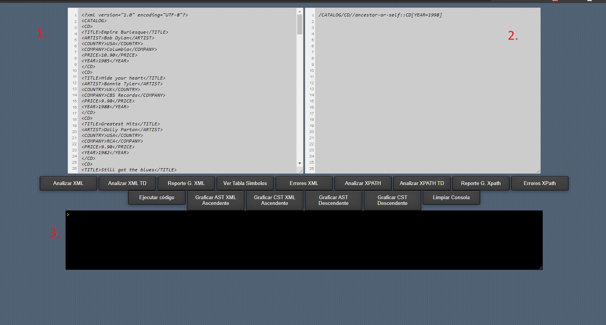
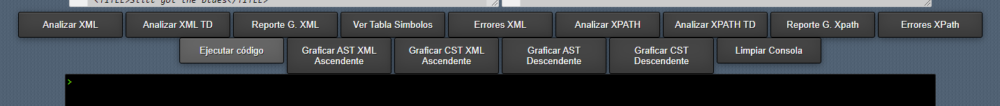
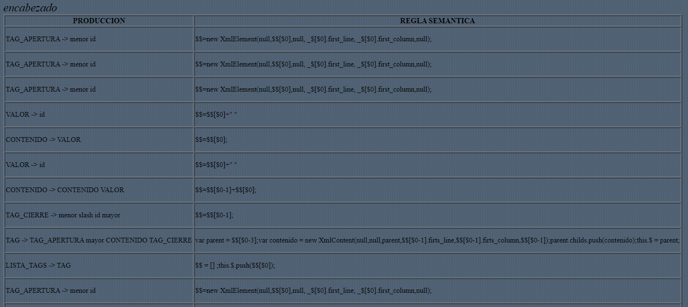
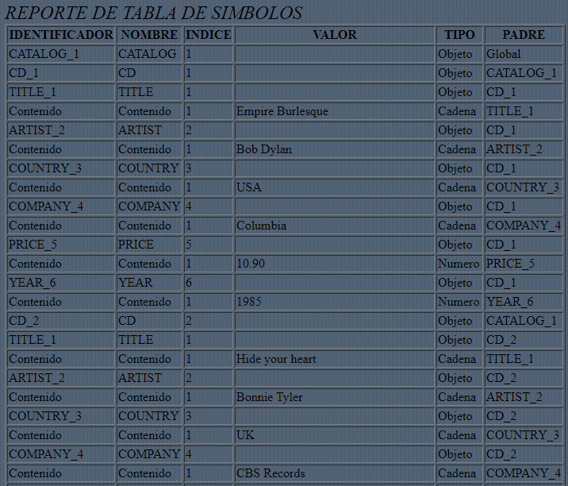
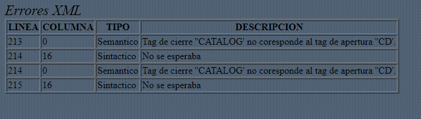
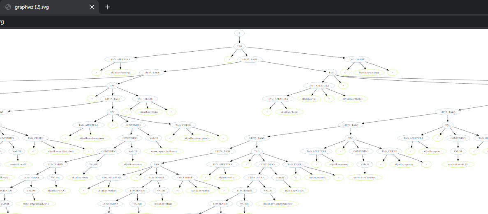
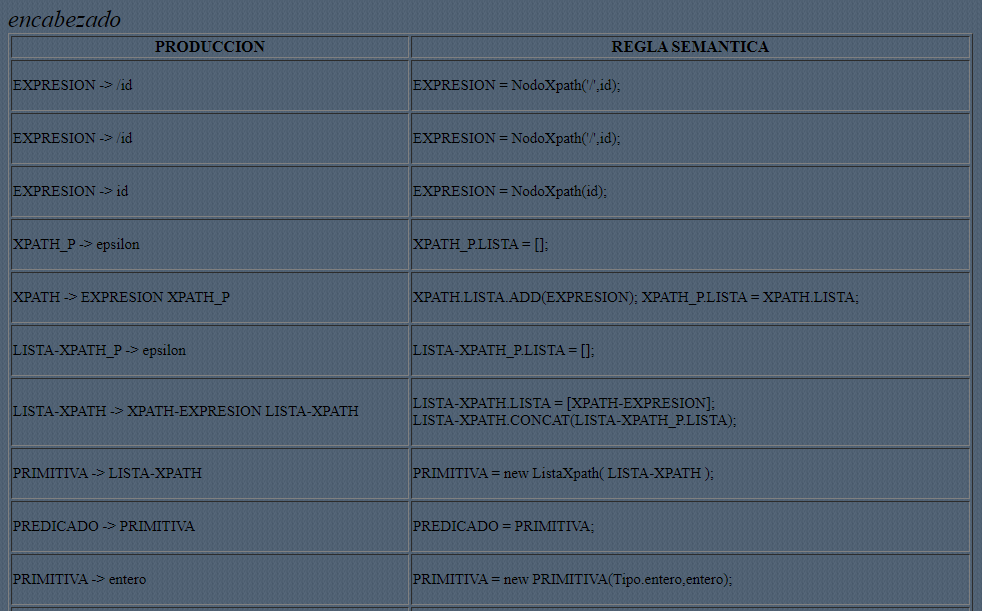
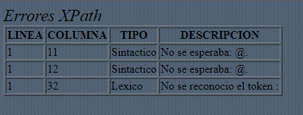
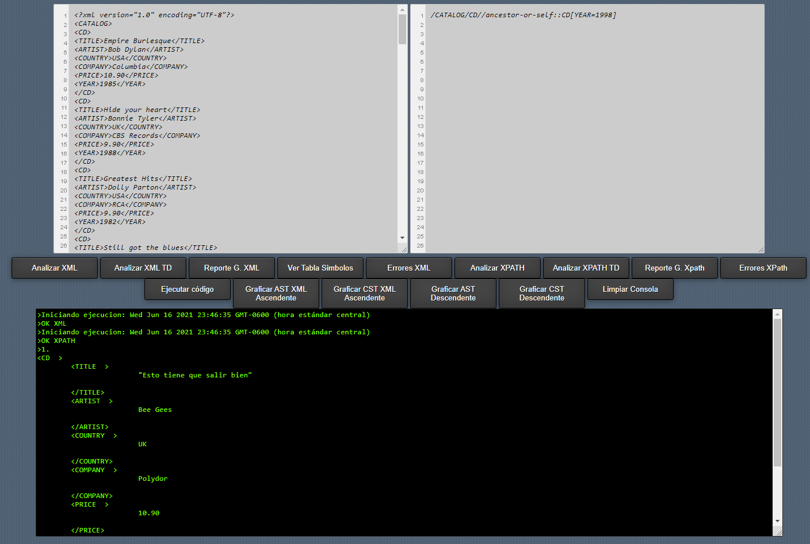

# *Lenguajes y Compiladores 2*

# **Manual Usuario TytusX**
# **Grupo 38**

# **I. Objetivos**

La aplicación TitusX tiene como objetivo poder crear consultas de archivos XML
por medio del lenguaje XPATH de una manera sencilla para el usuario y utilizando
herramientas de analisis sintactico.

Poder visualizar reportes de errores en las entradas de XML y XPATH
para poder detectarlos rapidamente y con precisión.

Poder observar los reportes gramaticas y arboles de analisis de sintaxis
utilizados en la creacion de TitusX.

# **II. Requerimientos**

<ol>
<li>Equipo Pentium IV o superior</li>
<li>Minimo 512mb de memoria RAM</li>
<li>Conexión a internet 1MB minimo</li>
<li>Navegador Google Chrome version 40 o posterior</li>
</ol>

# **III. Opciones del Sistema**

## Interfaz principal

<ol>
<li>Ventana de entrada para archivos en formato XML</li>
<li>Ventana de entrada para consultas con sintaxis XPATH</li>
<li>Consola de salida, muestra los resultados de las consultas en XPATH</li>
</ol>

## Descipcion de Funcionalidades

## XML 

A continuación una breve explicación de los botones que involucran
el uso del archivo XML

<ol>
<li>Analizar XML: Lee la entrada XML utilizando un analizador con gramatica ascendente</li>
<li>Analizar XML TD: Lee la entrada XML utilizando un analizador con gramatica descendente</li>
<li>

Reporte G. XML: Permite visualizar un reporte HTML con las producciónes en las que ha reducido
 la gramatica y las acciones semanticas asociadas a ellas. Esta opción solo se puede usar
al haber realizado previamente el Analisis de XML descritos en el inciso 1 y 2.

</li>
<li>

Ver Tabla Simbolos: Permite observar el detalle de los datos ingresados en la entrada de XML,
debe realizar el Analisis descritos en el inciso 1 y 2 para poder utilizar esta función.

 

</li>
<li>

Errores XML: Muestra un reporte con el detalle de errores lexicos, sintacticos o semanticos
para la entrada de XML, debe utilizar previamente las opciones descritas en el inciso 1 y 2 para visualizar
si hubo algun error.

</li>
<li>Graficas AST XML Ascendente: Muestra el AST de forma visual en una nueva pestaña, para visualizar 
este reporte debe utilizar la opción 1. Analizar XML previamente. Puede descargar este reporte para 
una facil visualización del mismo.</li>
<li>Graficas CST XML Ascendente: Muestra el CST de forma visual en una nueva pestaña, para visualizar 
este reporte debe utilizar la opción 1. Analizar XML, previamente. Puede descargar este reporte para 
una facil visualización del mismo.</li>
<li>Graficas AST Descendente: Muestra el AST de forma visual en una nueva pestaña, para visualizar 
este reporte debe utilizar la opción 2. Analizar XML TD previamente. Puede descargar este reporte para 
una facil visualización del mismo.</li>
<li>Graficas CST Descendente: Muestra el CST de forma visual en una nueva pestaña, para visualizar 
este reporte debe utilizar la opción 2. Analizar XML TD, previamente. Puede descargar este reporte para 
una facil visualización del mismo.</li>

</ol>

## XPATH

A continuación una breve explicación de los botones que involucran
el uso del archivo XPATH

<ol>
<li>Analizar XPATH: Lee la entrada XPATH utilizando un analizador con gramatica ascendente</li>
<li>Analizar XPATH TD: Lee la entrada XPATH utilizando un analizador con gramatica descendente</li>
<li>

Reporte G. XPath: Permite visualizar un reporte HTML con las producciónes en las que ha reducido
 la gramatica y las acciones semanticas asociadas a ellas. Esta opción solo se puede usar
al haber realizado previamente el Analisis de XPATH descritos en el inciso 1 y 2.

</li>
<li>

Errores XPath: Muestra un reporte con el detalle de errores lexicos, sintacticos o semanticos
para la entrada de XPath, debe utilizar previamente las opciones descritas en el inciso 1 y 2 para visualizar
si hubo algun error.

</li>
</ol>

## Obtención de Consultas

 Para obtener consultas, necesitamos tener cargado un archivo XML valido
y una consulta XPATH en sus respectivas ventanas de texto, luego procedemos a 
presionar la opción Ejectuar código, la cual carga en la consola de salida el resultado
de nuestra consulta.

